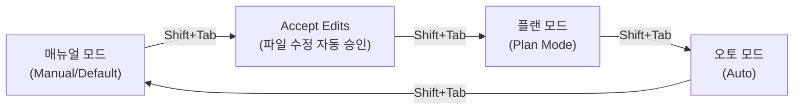

## 클로드 코드란

**클로드 코드(Claude Code)**는 터미널 안에서 코드를 읽고, 고치고, 실행까지 해주는 AI 도구다.
그냥 "질문하고 답 받기"가 아니라, 실제로 내 파일을 열어보고 수정하고 명령어를 실행할 수 있다는 점이 다르다.
그래서 "AI한테 시키기만 하면 끝"이 아니라, **어떤 모드로 어떻게 시키는지**가 중요하다는 걸 이번에 배웠다.

## Shift+Tab으로 바뀌는 네 가지 모드

처음엔 "자동으로 승인해주는 모드"가 하나라고 생각했는데, 알고 보니 **자동 수락(Accept Edits)**과 **오토 모드(Auto)**는 서로 다른 모드였다.
`Shift+Tab`을 누르면 아래 네 모드가 순서대로 바뀐다.

| 모드 | 설명 | 언제 쓰나 |
|---|---|---|
| 매뉴얼 모드 (Manual/Default) | 파일 수정이든 명령 실행이든, 매번 나에게 허락을 구한다 | 클로드가 뭘 하는지 하나하나 확인하고 싶을 때 |
| Accept Edits | 파일 읽기·수정과, `mkdir`/`mv`/`cp`처럼 정해진 몇 개의 파일 관련 명령만 자동으로 승인한다. 그 외 명령은 여전히 물어본다 | 코드 수정 자체는 믿지만, 다른 명령 실행까지 맡기긴 이를 때 |
| 플랜 모드 (Plan Mode) | 코드를 수정하지 않고, 계획만 세운다 | 복잡한 작업 전에 "어떻게 할 건지"부터 점검하고 싶을 때 |
| 오토 모드 (Auto) | 파일 수정은 물론, 명령어 실행까지 거의 다 자동으로 승인한다. 다만 위험해 보이는 행동은 별도의 검사 과정이 한 번 더 걸러준다 | 방향을 완전히 믿고, 속도를 최대로 내고 싶을 때 |

**Accept Edits**와 **오토 모드**를 처음엔 같은 걸로 착각했는데, 범위가 달랐다.
Accept Edits는 "파일 관련 작업만" 자동 승인하는 좁은 범위이고, 오토 모드는 "거의 모든 행동"을 자동 승인하는 넓은 범위다.
그만큼 오토 모드는 편하지만, 그 대신 위험한 행동을 걸러주는 검사 장치에 더 의존하게 된다는 뜻이기도 하다.

네 모드 중에서 **플랜 모드**가 가장 중요하다고 느꼈다.
바로 코드를 고치게 두지 않고, "이렇게 할 거예요"라는 계획을 먼저 보여주게 만들기 때문이다.
계획 단계에서 방향이 틀렸으면 여기서 바로잡을 수 있다.

## 프롬프트에 맥락·역할·제약·예시를 넣으면 좋은 이유

그냥 "정리해줘"라고 시키는 것과, 아래처럼 네 가지를 채워서 시키는 것은 결과물이 많이 달랐다.

| 항목 | 하는 역할 | 넣지 않았을 때 생기는 문제 |
|---|---|---|
| 맥락 (Context) | 지금 상황이 뭔지 알려준다 (예: 독학 중, 이번 주에 Git 처음 배움) | AI가 내 수준을 모르고 너무 어렵거나 너무 뻔한 답을 준다 |
| 역할 (Role) | AI가 어떤 입장에서 답할지 정한다 (예: 초보에게 설명하는 선생님) | 설명 톤과 깊이가 매번 달라져서 글의 일관성이 깨진다 |
| 제약 (Constraints) | 다뤄야 할 범위와 다루면 안 되는 범위를 정한다 | 아직 안 배운 명령어까지 섞여 나와서 오히려 헷갈린다 |
| 예시 (Example) | 원하는 출력 형식을 직접 보여준다 | 표로 원했는데 줄글로 나오는 등, 형식이 매번 달라진다 |

정리하면, 이 네 가지는 **AI가 알아서 잘 판단하길 기대하는 부분을 내가 직접 정해주는 것**이다.
맥락·역할·제약·예시가 없으면 그 빈자리를 AI가 자기 마음대로 채우게 된다.

## 클로드는 증폭제일 뿐, 생각은 내가 해야 한다

이번 주에 가장 조심해야겠다고 느낀 부분이다.
클로드에게 "알아서 해줘"라고만 계속 시키면, 결과물은 빨리 나오지만 **왜 그렇게 했는지 내가 설명을 못 하는 상태**가 된다.
이건 배우는 입장에서는 오히려 손해다.

그래서 이렇게 쓰기로 했다.

- **플랜 모드**로 먼저 계획을 받고, 그 계획이 맞는지 내가 판단한 뒤에 실행시킨다.
- 새로운 걸 배울 때는 **매뉴얼 모드**로 하나씩 확인하고, Accept Edits나 오토 모드는 방향이 확실해진 뒤에만 쓴다.
- 클로드가 짠 결과를 그대로 쓰지 않고, **왜 이렇게 했는지** 한 번은 물어보거나 직접 읽어본다.

클로드는 내 생각을 대신해주는 도구가 아니라, **내가 세운 방향을 더 빠르게 실현해주는 증폭제**로 써야
AI에 끌려다니지 않고 계속 스스로 판단하는 힘을 기를 수 있다고 생각한다.
