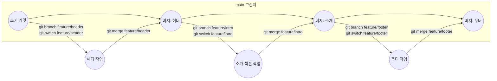

## 들어가며 (Situation)

팀원 3명과 블로그 프로젝트를 진행하고 있었다.
각자 다른 기능(헤더, 소개 섹션, 푸터)을 동시에 작업해야 하는 상황이었는데,
아직 Git을 배운 지 얼마 안 돼서 브랜치를 어떻게 나눠야 하는지 감이 없는 상태로 시작했다.

## 문제 상황 (Task)

처음엔 다들 `main`에 직접 커밋했다.
그러다 한 명이 올린 코드가 다른 사람의 작업을 덮어써서, 되돌리는 데 시간을 썼다.
문제는 단순히 "누가 실수했나"가 아니라, **애초에 여러 명이 같은 브랜치에 동시에 커밋하는 구조 자체**였다.

## 해결 과정 (Action)

### 검토한 방식 비교

| 방식 | 설명 | 장점 | 단점 |
|---|---|---|---|
| `main`에 직접 커밋 | 브랜치 없이 다 같이 `main`만 사용 | 단순함 | 서로 작업을 덮어쓰기 쉬움 |
| 기능별 브랜치 | 기능마다 브랜치를 따로 만들어 작업 | 서로의 작업이 섞이지 않음 | 브랜치 관리, 이름 규칙이 필요함 |

우리는 팀 규모가 작고(3명), 아직 배포 주기 같은 복잡한 규칙이 필요 없었기 때문에
**기능별 브랜치** 방식을 선택했다. `main`은 완성된 것만 머지하는 브랜치로 두기로 했다.

### 실제 적용한 흐름

규칙은 단순했다.

1. 새 기능을 시작할 때는 `main`에서 `git branch feature/기능이름`으로 브랜치를 만든다.
2. `git switch feature/기능이름`으로 이동해서 그 브랜치 안에서만 작업한다.
3. 작업이 끝나면 `main`으로 돌아와 `git pull`로 최신 상태를 받은 뒤 `git merge feature/기능이름`으로 합친다.

### 겪은 시행착오

브랜치 이름을 처음엔 통일하지 않아서 `header-work`, `feature-intro`, `footer_fix`처럼 제각각이었다.
누가 어떤 브랜치에서 뭘 하는지 한눈에 안 보여서, 결국 `feature/기능이름` 형태로 통일했다.

## 결과 (Result)

| 항목 | Before (브랜치 없이) | After (기능별 브랜치) |
|---|---|---|
| 일주일간 작업 덮어쓰기 사고 | 2~3회 | 0회 |
| 문제 생겼을 때 되돌리는 범위 | `main` 전체 확인 필요 | 해당 브랜치만 확인하면 됨 |
| 브랜치 이름 규칙 | 없음 | `feature/기능이름`으로 통일 |

가장 크게 배운 점은, 브랜치 전략은 "정답 하나"가 아니라 **팀 규모와 상황에 맞는 최소한의 규칙을 정하는 것**이라는 점이었다.
지금은 인원이 적어서 `main` + `feature/*` 정도로 충분했지만, 팀이 커지면 다른 규칙이 필요할 것 같다.

## 더 학습하면 좋은 개념

- **GitHub Flow** — `main`과 기능 브랜치만 사용하는 단순한 흐름으로, 지금 우리 팀이 자연스럽게 만든 규칙과 가장 비슷하다. 왜 이 흐름이 작은 팀에 적합한지 공식 문서로 확인하면 좋다.
- **Pull Request 기반 리뷰** — 지금은 `merge`를 각자 로컬에서 바로 했는데, PR을 거치면 머지 전에 서로 코드를 확인할 수 있다. 팀 작업에서 다음 단계로 배워볼 만하다.
- **브랜치 보호 규칙 (Branch Protection)** — `main`에 실수로 직접 커밋하는 걸 막아주는 GitHub 설정. 우리가 겪은 문제(직접 커밋으로 인한 덮어쓰기)를 규칙으로 막을 수 있다.
- **머지 충돌 해결** — 이번엔 운 좋게 충돌이 크게 없었지만, 브랜치를 나눠 쓰다 보면 결국 충돌을 마주치게 된다. 미리 개념을 익혀두면 당황하지 않을 것 같다.

## 참고 자료

- [Git 공식 문서 - Git Branching: 브랜치란](https://git-scm.com/book/en/v2/Git-Branching-Branches-in-a-Nutshell)
- [GitHub 공식 문서 - GitHub flow](https://docs.github.com/en/get-started/using-github/github-flow)
