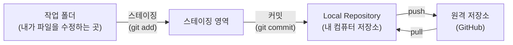
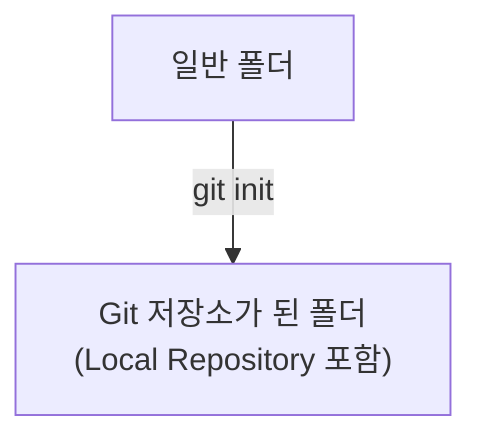
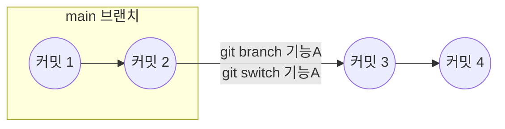
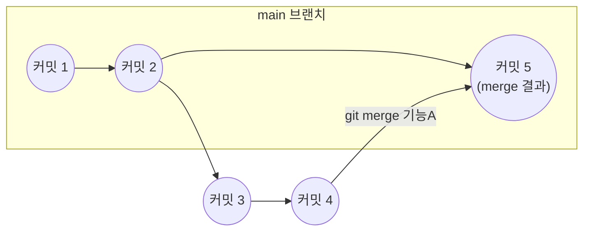
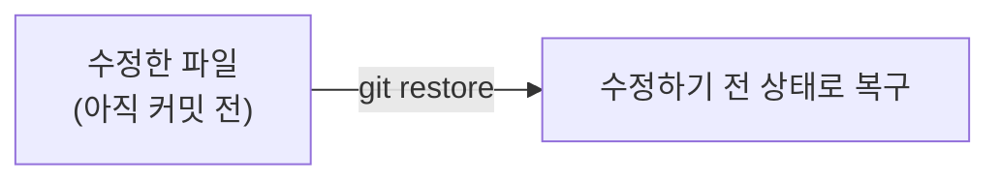

안녕하세요! 이번 주에 Git을 처음 배운 학생 여러분을 위해, 배운 내용만 딱 정리해볼게요.
새로운 명령어를 더 얹지 않고, **이번 주에 배운 것만** 순서대로 따라가 볼 겁니다.

## 1. 전체 흐름 한눈에 보기

Git으로 파일을 관리할 때, 파일은 아래 네 공간을 순서대로 이동합니다.

이 그림 하나만 기억해도 이번 주 배운 것의 절반은 이해한 겁니다.
아래에서 하나씩 뜯어볼게요.

## 2. 저장소 만들기 — Local Repository의 시작

Git으로 뭔가를 기록하려면, 먼저 그 폴더를 "Git이 관리하는 폴더"로 만들어야 합니다.
이 작업이 바로 **저장소 만들기**입니다.

| 명령어 | 언제 쓰나 |
|---|---|
| `git init` | 지금 있는 폴더를 Git 저장소로 새로 만들고 싶을 때 |

저장소를 만들고 나면, 이 폴더 안에 **Local Repository**라는 것이 생깁니다.
Local Repository는 "내 컴퓨터 안에만 있는 저장소"라고 생각하면 됩니다.
아직 GitHub에 올리기 전, 내 컴퓨터 안에서만 기록이 쌓이는 공간입니다.

## 3. 스테이징 — 커밋에 담을 것을 고르기

파일을 수정했다고 바로 기록(커밋)되는 건 아닙니다.
**어떤 수정사항을 이번 기록에 담을지** 먼저 골라야 하는데, 이 과정이 **스테이징**입니다.

| 명령어 | 언제 쓰나 |
|---|---|
| `git add` | 수정한 파일 중, 이번 커밋에 포함할 파일을 고를 때 |

파일을 두 개 고쳤는데 하나만 기록하고 싶을 때가 있죠?
그래서 "수정 → 바로 기록"이 아니라, "수정 → 고르기(스테이징) → 기록(커밋)" 순서로 나뉘어 있습니다.

## 4. 커밋 — Local Repository에 기록 남기기

스테이징한 내용을 하나의 저장 지점으로 기록하는 것이 **커밋**입니다.

| 명령어 | 언제 쓰나 |
|---|---|
| `git commit -m "메시지"` | 스테이징한 내용을 하나의 기록으로 남기고 싶을 때 |

커밋을 하면, 그 기록은 바로 **Local Repository**에 저장됩니다.
아직 GitHub에는 올라가지 않은 상태예요. 이 상태에서 컴퓨터가 꺼져도 기록은 남아 있습니다.

## 5. 브랜치 — 원본을 건드리지 않고 작업하기

메인 작업 흐름(보통 `main`)을 건드리지 않고, 따로 실험하거나 기능을 만들고 싶을 때 **브랜치**를 사용합니다.

| 명령어 | 언제 쓰나 |
|---|---|
| `git branch 기능A` | `기능A`라는 새 브랜치를 만들고 싶을 때 |
| `git switch 기능A` | 만들어둔 `기능A` 브랜치로 옮겨가서 작업하고 싶을 때 |

이렇게 하면 `main`은 그대로 두고, `기능A` 브랜치에서만 새 커밋이 쌓입니다.

## 6. push와 pull — GitHub와 주고받기

내 컴퓨터의 Local Repository와 GitHub의 원격 저장소는 자동으로 동기화되지 않습니다.
**push**로 올리고, **pull**로 받아와야 합니다.

| 명령어 | 언제 쓰나 |
|---|---|
| `git push origin main` | 내 Local Repository의 기록을 GitHub에 올리고 싶을 때 |
| `git pull origin main` | GitHub에 있는 최신 기록을 내 컴퓨터로 받아오고 싶을 때 (예: 팀원이 먼저 올렸을 때) |

팀 작업에서는 내가 push하기 전에, 팀원이 먼저 올린 내용을 **pull**로 받아와야 충돌을 줄일 수 있습니다.

## 7. merge — 브랜치 합치기

브랜치에서 작업을 끝냈다면, 그 내용을 다시 `main`으로 합쳐야 합니다. 이게 **merge**입니다.

| 명령어 | 언제 쓰나 |
|---|---|
| `git merge 기능A` | `기능A` 브랜치에서 한 작업을 지금 브랜치(보통 `main`)에 합치고 싶을 때 |

## 8. 되돌리기 — 실수했을 때 되돌아가기

Git의 가장 큰 장점은 **저장 지점을 남기고, 필요하면 되돌릴 수 있다**는 점입니다.

| 명령어 | 언제 쓰나 |
|---|---|
| `git restore 파일명` | 커밋하기 전에 수정한 파일을, 수정하기 전 상태로 되돌리고 싶을 때 |

아직 커밋하지 않은 실수라면, `git restore`로 마지막 커밋 상태로 되돌아갈 수 있습니다.

## 9. 이번 주 배운 명령어 전체 표

| 명령어 | 언제 쓰나 |
|---|---|
| `git init` | 새 폴더를 Git 저장소로 만들고 싶을 때 |
| `git add` | 커밋에 담을 변경사항을 고르고 싶을 때 (스테이징) |
| `git commit -m "메시지"` | 고른 변경사항을 Local Repository에 기록하고 싶을 때 |
| `git branch 이름` | 새 브랜치를 만들고 싶을 때 |
| `git switch 이름` | 다른 브랜치로 옮겨가고 싶을 때 |
| `git push origin main` | 내 기록을 GitHub에 올리고 싶을 때 |
| `git pull origin main` | GitHub의 최신 기록을 받아오고 싶을 때 |
| `git merge 이름` | 다른 브랜치의 작업을 지금 브랜치에 합치고 싶을 때 |
| `git restore 파일명` | 커밋 전 수정 내용을 되돌리고 싶을 때 |

## 마무리

이번 주 흐름을 한 문장으로 정리하면 이렇습니다.

> 저장소를 만들고(`init`) → 고쳐서 고르고(`add`) → 기록하고(`commit`) →
> 필요하면 브랜치를 나눴다 합치고(`branch`, `switch`, `merge`) →
> GitHub와 주고받고(`push`, `pull`) → 실수하면 되돌린다(`restore`).

다음 주에는 이 흐름 위에서 팀원과 같이 작업하다가 겪는 문제들(예: 충돌)을 정리해볼 예정입니다.
