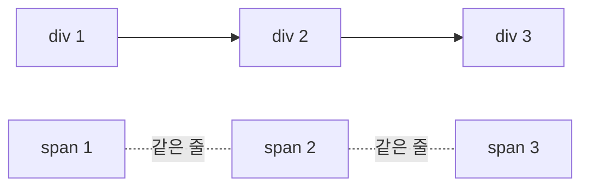

안녕하세요! 이번에는 HTML 기본 태그 7가지를 정리해봤습니다.
`01_글자관련태그`부터 `07_하이퍼관련태그`까지, 실습한 순서 그대로 따라가 볼게요.

## 1. 글자 관련 태그

제목은 `h1`부터 `h6`까지 크기 순서대로 있고, 문단은 `p`와 `pre`로 나눕니다.

| 태그 | 역할 |
|---|---|
| `h1`~`h6` | 제목 (숫자가 작을수록 크고 중요한 제목) |
| `p` | 문단 나누기 (공백·줄바꿈을 한 칸으로 합침) |
| `pre` | 문단 나누기 (작성한 공백·줄바꿈을 그대로 표시) |
| `br` | 줄바꿈 |
| `hr` | 수평선 (구역 구분) |

기타 텍스트 스타일 태그는 겉모습은 비슷해도 의미가 다른 경우가 있습니다.

| 태그 | 효과 | 비고 |
|---|---|---|
| `strong` | 굵게 | 중요한 내용임을 의미 |
| `b` | 굵게 | 단순 스타일(의미 없음) |
| `em` | 기울임 | 강조를 의미 |
| `i` | 기울임 | 단순 스타일(의미 없음) |
| `mark` | 형광펜 효과 | |
| `u` | 밑줄 | |
| `s` | 취소선 | |
| `small` | 글자 작게 | |
| `sub` / `sup` | 아래첨자 / 윗첨자 | |

```html
<p>일반 문단은 줄바꿈이 무시된다.</p>
<strong>중요한 내용은 strong</strong>
<em>강조는 em</em>
```

## 2. 목록 관련 태그

순서가 없으면 `ul`, 순서가 있으면 `ol`을 씁니다.

| 태그 | 역할 |
|---|---|
| `ul > li` | 순서 없는 목록 (・ 불릿) |
| `ol > li` | 순서 있는 목록 (숫자·문자) |
| `ol type="A"` | 목록 번호를 알파벳으로 |
| `ol type="I"` | 목록 번호를 로마 숫자로 |

```html
<ol type="A">
    <li>HTML</li>
    <li>CSS</li>
    <li>JS</li>
</ol>
```

## 3. 표 관련 태그

표는 `table`, `tr`, `th`, `td` 네 가지 조합입니다.

| 태그 | 역할 |
|---|---|
| `table` | 표 전체 영역 |
| `tr` | 표의 행(줄) |
| `th` | 표의 제목 셀 |
| `td` | 표의 데이터 셀 |
| `colspan` | 열 합치기 |
| `rowspan` | 행 합치기 |

```html
<table border="2">
    <caption>회원 이력서</caption>
    <tr>
        <td colspan="2" rowspan="2">사진</td>
        <td>이름</td>
        <td></td>
    </tr>
</table>
```

## 4. 영역 관련 태그

`div`와 `span`은 둘 다 영역을 묶지만, 줄바꿈 여부가 다릅니다.

| 태그 | 줄바꿈 | 분류 |
|---|---|---|
| `div` | 있음 | 블록 요소 |
| `span` | 없음 | 인라인 요소 |



여러 요소를 하나로 묶어 공통 스타일을 줄 때 `div`(영역 전체), `span`(문장 속 일부)을 구분해서 씁니다.

## 5. 이미지 관련 태그

`img`는 닫는 태그가 없는 단일 태그입니다.

| 속성 | 역할 |
|---|---|
| `src` | 이미지 파일 경로 |
| `alt` | 이미지를 못 불러올 때 대신 보여줄 텍스트 |
| `width`(px) / `height`(px) | 고정 크기 — 화면이 커져도 그대로 |
| `width`(%) | 가변 크기 — 화면 크기에 비례해서 변함 |

```html


```

## 6. 미디어 관련 태그

오디오는 `audio`, 비디오는 `video` 태그를 씁니다.

| 속성 | 역할 |
|---|---|
| `src` | 미디어 파일 경로 |
| `controls` | 재생/정지 등 컨트롤 바 표시 |
| `loop` | 반복 재생 |

```html
<audio src="/sample/sample/audio/major.mp3" controls loop></audio>
<video src="/sample/sample/video/video1.mp4" controls loop width="400px" height="300px"></video>
```

## 7. 하이퍼링크 관련 태그

`a` 태그의 `href`는 "어디로", `target`은 "어떤 창에서" 이동할지를 정합니다.

| 속성/값 | 역할 |
|---|---|
| `href="주소"` | 이동할 경로(외부 URL, 다른 파일, `#id`) |
| `target="_blank"` | 새 탭에서 열기 |
| `target="_self"` | 현재 탭에서 열기(기본값) |
| `href="#id값"` | 같은 페이지 안에서 해당 `id`로 이동 |

```html
<a href="https://www.google.com" target="_blank">구글로 이동</a>
<a href="#index1">목차 1로 이동</a>
<h4 id="index1">목차 1번 영역</h4>
```

이미지도 `a`로 감싸면 클릭 가능한 링크가 됩니다.

```html
<a href="https://skinopero.github.io/my-blog/">
    
</a>
```

> ⚠️ `target` 값은 `_self`, `_blank`, `_parent`, `_top`처럼 정해진 값 외의 문자열을 넣으면, 그 이름의 새 창(브라우징 컨텍스트)을 여는 것으로 처리됩니다. 오타(`_slef` 등)를 내면 원하는 동작(현재 탭 유지)이 아니라 새 창이 열려버리니 철자에 주의해야 합니다. ([MDN 참고](https://developer.mozilla.org/en-US/docs/Web/HTML/Element/a#target))

## 8. 작업을 빠르게 해주는 단축키 · 문법

| 단축키/문법 | 기능 |
|---|---|
| `Alt + L + O` | 작성 중인 HTML 파일을 브라우저(사이트)로 열어서 확인 |
| `태그명*숫자` + `Tab` (Emmet) | 같은 태그를 지정한 개수만큼 한 번에 생성 (예: `li*3` → `<li></li>`가 3개) |
| `부모>자식` + `Tab` (Emmet) | 부모-자식 관계를 한 번에 생성 (예: `ul>li*3` → `ul` 안에 `li` 3개) |
| `!` + `Tab` (Emmet) | HTML 뼈대 코드(`doctype`, `html`, `head`, `body`) 한 번에 생성 |

이번 실습(`02_목록관련태그.html`)에서는 `ul>li*3`로 빈 `li` 3개를 가진 `ul`을 한 번에 만들었습니다.

```
ul>li*3 + Tab
→
<ul>
    <li></li>
    <li></li>
    <li></li>
</ul>
```

## 9. 전체 태그 한눈에 보기

| 분류 | 주요 태그 |
|---|---|
| 글자 | `h1~h6`, `p`, `pre`, `strong`, `em`, `b`, `i`, `mark`, `u`, `s`, `small`, `sub`, `sup` |
| 목록 | `ul`, `ol`, `li` |
| 표 | `table`, `tr`, `th`, `td`, `caption` |
| 영역 | `div`, `span` |
| 이미지 | `img` |
| 미디어 | `audio`, `video` |
| 하이퍼링크 | `a` |

## 마무리

이번에 배운 걸 한 문장으로 정리하면 이렇습니다.

> 글자는 `h`/`p`/`pre`로, 목록은 `ul`/`ol`로, 표는 `table`/`tr`/`td`로,
> 영역은 `div`(블록)/`span`(인라인)으로, 이미지는 `img`로, 미디어는 `audio`/`video`로,
> 다른 곳으로 이동할 땐 `a`의 `href`/`target`으로 처리한다.

다음에는 이 태그들을 CSS로 꾸미는 내용을 정리해볼 예정입니다.
