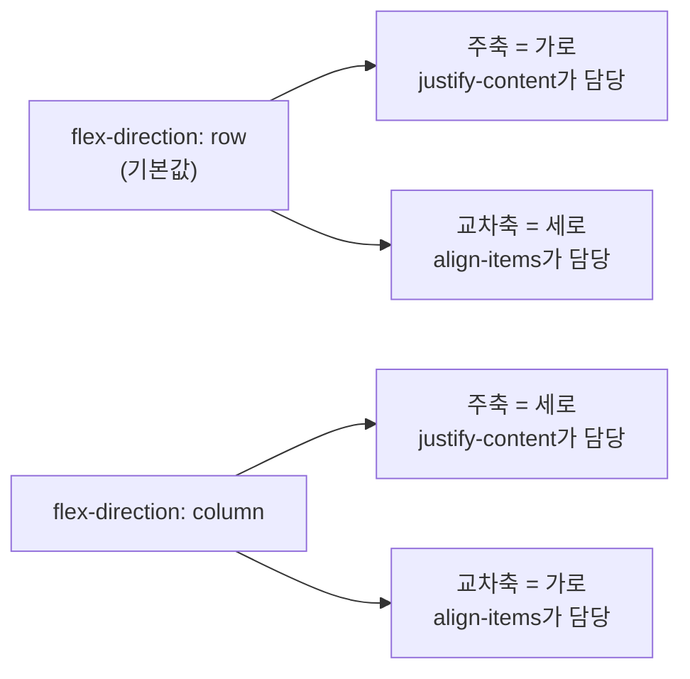
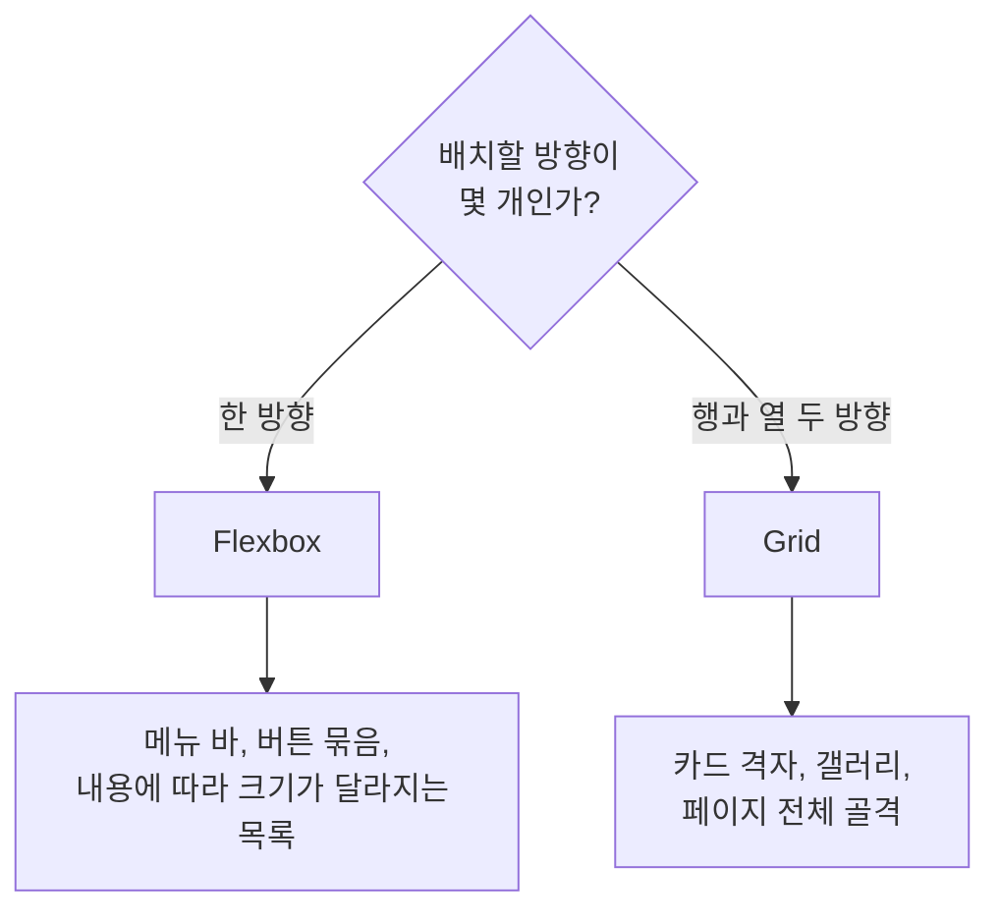

`05_flex_grid` 실습 내용을 정리했습니다. 상품 카드를 가로로 늘어놓는 것을 목표로, 배치 방법을 단계별로 정리합니다.

## 1. 왜 배치를 따로 배워야 하는가

`div`만으로 영역을 나누면 두 가지 한계가 있습니다.

- `div`는 자기 줄을 통째로 차지하므로 가로로 나란히 놓을 수 없습니다.
- 화면 크기가 바뀔 때 유연하게 재배치되지 않습니다.

그래서 `display`로 요소의 성격을 바꾸거나, Flexbox·Grid 같은 배치 방식을 쓰게 됩니다.

## 2. 블록과 인라인

| 구분 | 기본 태그 | 쌓이는 방향 | 너비·높이 지정 |
|------|-----------|-------------|----------------|
| 블록(block) | `div`, `p`, `h1` | 아래로 쌓인다 | 가능 |
| 인라인(inline) | `span`, `a` | 옆으로 이어진다 | 불가능 |
| 인라인 블록(inline-block) | — | 옆으로 이어진다 | 가능 |

핵심은 **태그의 성격이 고정된 것이 아니라는 점**입니다. `display`로 서로 바꿀 수 있습니다.

```css
/* span인데 자기 줄을 차지하게 만든다 */
.box-block-span { display: block; }

/* div인데 옆으로 붙게 만든다 */
.box-inline-div { display: inline; }
```

`inline-block`이 따로 있는 이유는 위 표의 마지막 열 때문입니다. `inline`은 너비가 먹지 않지만, `inline-block`은 옆으로 이어지면서도 너비·높이를 줄 수 있습니다.

## 3. Flexbox — 한 줄로 세우고 정렬하기

Flexbox는 항목을 **한 방향 줄로 세우는** 배치 방식입니다.

### 3.1 컨테이너와 아이템

`display: flex`는 **카드가 아니라 카드를 감싸는 상자에** 줘야 합니다. 이때 역할 이름이 나뉩니다.

- **플렉스 컨테이너**: `display: flex`를 받은 감싸는 상자
- **플렉스 아이템**: 컨테이너 안의 카드 하나하나

```html
<main class="card-list">        <!-- 컨테이너 -->
  <div class="card">...</div>   <!-- 아이템 -->
  <div class="card">...</div>
  <div class="card">...</div>
</main>
```

### 3.2 두 개의 축

Flexbox를 이해하는 열쇠는 축이 두 개라는 것입니다.



| 축 | 의미 | 정렬 속성 |
|----|------|-----------|
| 주축(main axis) | `flex-direction`이 정한 방향 | `justify-content` |
| 교차축(cross axis) | 주축과 수직인 축 | `align-items` |

**`flex-direction`을 바꾸면 두 정렬 속성의 담당 방향이 서로 뒤바뀝니다.** `justify-content`가 항상 가로인 것이 아니라, 주축이 어디냐에 따라 달라집니다.

### 3.3 주축 정렬 — `justify-content`

| 값 | 동작 |
|----|------|
| `flex-start` | 시작점에 모은다 (기본값) |
| `center` | 가운데에 모은다 |
| `flex-end` | 끝점에 모은다 |
| `space-between` | 양 끝에 붙이고 사이 간격을 고르게 나눈다 |
| `space-around` | 각 항목이 좌우로 같은 여백을 갖는다 (끝 여백이 절반) |
| `space-evenly` | 바깥 여백까지 모두 똑같이 나눈다 |

`space-between`·`space-around`·`space-evenly`는 셋 다 "고르게 나눈다"지만 **바깥쪽 여백 처리가 다릅니다.**

### 3.4 교차축 정렬 — `align-items`

| 값 | 동작 |
|----|------|
| `stretch` | 컨테이너 높이만큼 늘린다 (기본값) |
| `flex-start` | 위쪽 끝 맞춤 |
| `center` | 가운데 맞춤 |
| `flex-end` | 아래쪽 끝 맞춤 |

기본값이 `stretch`이기 때문에 **카드 높이가 서로 같아 보이는 것이 기본 동작**입니다. 설명이 한 줄 더 있는 카드만 길어지게 하려면 `flex-start` 등으로 바꿔서 각 카드가 자기 내용만큼만 높이를 갖게 해야 합니다.

### 3.5 간격과 줄바꿈

```css
.card-list {
  display: flex;
  flex-direction: row;
  justify-content: flex-end;
  align-items: flex-start;
  gap: 20px;
  flex-wrap: wrap;
}
```

| 속성 | 값 | 동작 |
|------|-----|------|
| `gap` | 길이 | 아이템 사이 간격 |
| `flex-wrap` | `nowrap` | 기본값. 한 줄에 밀어넣어 아이템이 줄어들거나 넘친다 |
| | `wrap` | 폭이 부족하면 다음 줄로 내려간다 |

`gap`은 `margin`으로 간격을 주던 방식을 대체합니다. `margin`은 맨 끝 아이템에도 여백이 붙어 따로 제거해야 했는데, `gap`은 **사이에만** 적용됩니다.

## 4. Grid — 칸을 그려두고 넣기

Grid는 **행과 열, 두 방향을 함께** 정하는 배치 방식입니다.

```css
.grid-list {
  display: grid;
  grid-template-columns: repeat(3, 1fr);
  gap: 20px;
}
```

| 문법 | 의미 |
|------|------|
| `display: grid` | 그리드 컨테이너로 만든다. 이것만 쓰면 열이 1개다 |
| `repeat(3, 1fr)` | `1fr 1fr 1fr`의 축약. 열 3개 |
| `fr` | fraction. 남은 공간을 몫으로 나눠 갖는 단위 |

### 행 개수를 지정하지 않아도 되는 이유

**열을 정하면 행은 자동으로 결정됩니다.** 아이템 6개를 3열에 넣으면 행은 2개가 됩니다. 아이템이 늘어나면 행이 알아서 추가됩니다.

## 5. Flex와 Grid 중 무엇을 쓸까

한 문장으로 구분하면 이렇습니다.

> Flex는 **한 줄로 세우고 정렬**, Grid는 **칸을 그려두고 칸에 넣으며 정렬**



| 기준 | Flexbox | Grid |
|------|---------|------|
| 다루는 축 | 한 방향(주축) | 두 방향(행·열) |
| 크기 결정 주도권 | 콘텐츠 중심 | 컨테이너 중심 |
| 칸 개수 | 내용에 따라 흐른다 | 미리 정해둔다 |
| 적합한 경우 | 내비게이션, 버튼 묶음 | 카드 격자, 페이지 레이아웃 |

둘은 대체 관계가 아니라 **중첩해서 함께 쓰는 것이 일반적**입니다. Grid로 페이지 골격을 잡고, 각 칸 안에서 Flex로 요소를 정렬하는 조합이 많이 쓰입니다.

## 더 학습하면 좋은 개념

- **`flex-grow` / `flex-shrink` / `flex-basis`** — 이번에는 컨테이너 쪽 속성만 다뤘다. 아이템이 남은 공간을 얼마나 가져갈지, 좁아질 때 얼마나 줄어들지는 아이템 쪽 속성이 결정한다. `flex: 1`이라는 축약형의 정체를 알게 된다.
- **`minmax()`와 `auto-fit` / `auto-fill`** — `repeat(auto-fit, minmax(200px, 1fr))` 한 줄로 미디어 쿼리 없이 반응형 격자를 만들 수 있다. Grid를 실무에서 쓰는 핵심 패턴이다.
- **`grid-template-areas`** — 칸에 이름을 붙여 레이아웃을 그림처럼 선언하는 방식. 페이지 골격을 잡을 때 코드 가독성이 크게 올라간다.
- **`align-content`와 `align-items`의 차이** — 줄이 여러 개일 때(`flex-wrap: wrap`) 개별 아이템 정렬과 줄 뭉치 전체 정렬은 다른 속성이 담당한다. 헷갈리기 쉬운 지점이다.
- **정상 흐름(normal flow)과 서식 문맥** — Flex·Grid는 결국 기본 흐름을 벗어나는 방법이다. 기본 흐름이 어떻게 동작하는지 알면 `margin` 겹침이나 `inline` 요소의 여백 같은 현상이 설명된다.

## 참고 자료

- [MDN - display](https://developer.mozilla.org/en-US/docs/Web/CSS/display)
- [MDN - 플렉스박스의 기본 개념](https://developer.mozilla.org/ko/docs/Web/CSS/CSS_flexible_box_layout/Basic_concepts_of_flexbox)
- [MDN - flex-direction](https://developer.mozilla.org/ko/docs/Web/CSS/flex-direction)
- [MDN - justify-content](https://developer.mozilla.org/ko/docs/Web/CSS/justify-content)
- [MDN - align-items](https://developer.mozilla.org/ko/docs/Web/CSS/align-items)
- [MDN - flex-wrap](https://developer.mozilla.org/ko/docs/Web/CSS/flex-wrap)
- [MDN - gap](https://developer.mozilla.org/ko/docs/Web/CSS/gap)
- [MDN - CSS 그리드 레이아웃](https://developer.mozilla.org/ko/docs/Web/CSS/CSS_grid_layout)
- [MDN - 그리드 레이아웃의 기본 개념](https://developer.mozilla.org/ko/docs/Web/CSS/CSS_grid_layout/Basic_concepts_of_grid_layout)
- [MDN - grid-template-columns](https://developer.mozilla.org/ko/docs/Web/CSS/grid-template-columns)
