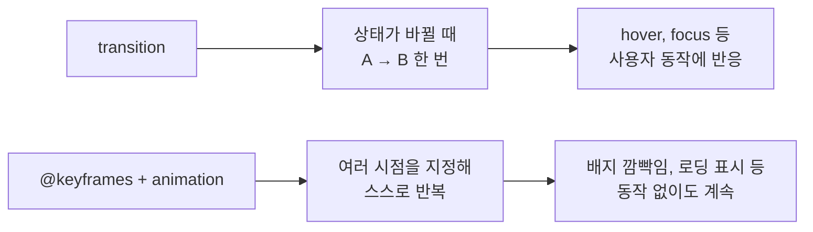

`06_before_tailwind`와 `07_after_tailwind` 실습 내용을 정리했습니다. **같은 상품 카드를 두 가지 방법으로 만들어 결과를 나란히 놓고 비교하는 것**이 이 차시의 목표입니다.

## 1. 순수 CSS로 움직임 넣기

### 1.1 `transition` — 어디에 써야 하는가

`transition`은 값이 바뀔 때 그 변화를 시간에 걸쳐 이어주는 속성입니다. 쓰는 위치가 중요합니다.

```css
.card {
  background-color: #FFFFFF;
  border: 1px solid #E5E7EB;
  border-radius: 8px;
  padding: 16px;
  /* :hover가 아니라 "원래 규칙"에 쓴다 */
  transition: all 0.3s;
}
```

| 쓰는 위치 | 결과 |
|-----------|------|
| 원래 규칙(`.card`) | 마우스를 올릴 때도, **뗄 때도** 부드럽게 움직인다 |
| `:hover` 안(`.card:hover`) | 올릴 때만 부드럽고, 뗄 때는 툭 끊긴다 |

`:hover`에 쓰면 마우스를 뗀 순간 `transition` 선언 자체가 사라지기 때문에 되돌아오는 변화에는 적용되지 않습니다.

### 1.2 `.card:hover` — 공백을 넣으면 안 된다

```css
.card:hover  { }   /* 카드 자신에 마우스가 올라갔을 때 */
.card :hover { }   /* 카드 안쪽의, 마우스가 올라간 요소 */
```

공백 하나가 **완전히 다른 뜻**이 됩니다. 붙여 쓰면 같은 요소에 대한 조건이 되고, 띄우면 자손 결합자가 되어 후손 요소를 가리킵니다.

### 1.3 `transform` — 자리는 그대로, 그림만 움직인다

```css
.card:hover {
  background-color: #F9FAFB;
  transform: translate(0, -8px) scale(1.05);
  box-shadow: 0 8px 20px rgba(0, 0, 0, 0.12);
}
```

| 함수 | 동작 |
|------|------|
| `translate(0, -8px)` | 위로 8px 띄운다 (y축은 아래가 양수) |
| `scale(1.05)` | 1.05배로 키운다 |

`transform`의 중요한 성질은 **레이아웃을 다시 계산하지 않는다**는 점입니다. 카드가 커져도 차지하는 자리는 그대로여서 **옆 카드가 비켜주지 않습니다.** 같은 효과를 `margin-top: -8px`이나 `width` 변경으로 만들면 주변 요소가 전부 밀립니다.

### 1.4 `@keyframes` — 반복되는 애니메이션

`transition`은 A에서 B로 한 번 가는 변화이고, `@keyframes`는 여러 시점의 모습을 직접 지정해 반복시키는 방식입니다.

```css
.badge {
  background-color: #DC2626;
  transform: rotate(-5deg);
  animation-name: blink;
  animation-duration: 1.2s;
  animation-iteration-count: infinite;
}

@keyframes blink {
  0%   { background-color: #DC2626; }
  50%  { background-color: #F97316; }
  100% { background-color: #DC2626; }
}
```

| 속성 | 역할 |
|------|------|
| `animation-name` | 어떤 `@keyframes`를 쓸지 |
| `animation-duration` | 한 바퀴에 걸리는 시간 |
| `animation-iteration-count` | 반복 횟수. `infinite`는 무한 |

**`0%`와 `100%`를 같은 값으로 두는 이유**는 한 바퀴가 끝나고 다시 시작할 때 색이 튀지 않게 하기 위함입니다. 중간에 원하는 모습이 있으면 `50%`처럼 그 시점을 직접 적어야 합니다.



## 2. 같은 결과를 Tailwind로

Tailwind는 **미리 만들어진 작은 클래스(유틸리티 클래스)를 HTML에 나열해** 스타일을 완성하는 방식입니다. CSS 파일을 따로 쓰지 않습니다.

브라우저에서 바로 시험할 때는 CDN 스크립트를 넣습니다.

```html
<script src="https://cdn.jsdelivr.net/npm/@tailwindcss/browser@4"></script>
```

### 2.1 두 방식 대조표

| 목적 | 순수 CSS | Tailwind |
|------|----------|----------|
| 가로 배치 + 가운데 정렬 + 간격 | `display: flex; justify-content: center; gap: 20px;` | `flex justify-center gap-5` |
| 흰 배경 | `background-color: #FFFFFF;` | `bg-white` |
| 회색 테두리 | `border: 1px solid #E5E7EB;` | `border border-gray-200` |
| 둥근 모서리 | `border-radius: 8px;` | `rounded-lg` |
| 안쪽 여백 | `padding: 16px;` | `p-4` |
| 썸네일 크기 | `width: 176px; height: 112px;` | `w-44 h-28` |
| 부드러운 변화 | `transition: all 0.3s;` | `transition` |
| 마우스 올렸을 때 배경 | `.card:hover { background-color: #F9FAFB; }` | `hover:bg-gray-50` |
| 위로 띄우기 | `transform: translate(0, -8px);` | `hover:-translate-y-2` |
| 확대 | `transform: scale(1.05);` | `hover:scale-105` |
| 그림자 | `box-shadow: 0 8px 20px ...;` | `hover:shadow-lg` |
| 알약 모양 배지 | `border-radius: 999px;` | `rounded-full` |

### 2.2 결과 코드

```html
<main class="flex justify-center gap-5">
  <div class="bg-white border border-gray-200 rounded-lg p-4 transition
              hover:bg-gray-50 hover:-translate-y-2 hover:scale-105 hover:shadow-lg">
    <div class="w-44 h-28 bg-gray-200 rounded"></div>
    <span class="inline-block bg-red-600 text-white text-sm px-2 py-1 rounded-full mt-2">NEW</span>
    <h2 class="text-lg font-bold mt-2 mb-1">무선 이어폰</h2>
    <p class="text-red-700">89,000원</p>
  </div>
</main>
```

### 2.3 숫자 규칙 읽는 법

Tailwind의 숫자는 픽셀이 아니라 **간격 단위(spacing scale)** 입니다. 기본값은 `1 = 0.25rem = 4px`입니다.

| 클래스 | 계산 | 결과 |
|--------|------|------|
| `p-4` | 4 × 4px | `padding: 16px` |
| `gap-5` | 5 × 4px | `gap: 20px` |
| `w-44` | 44 × 4px | `width: 176px` |
| `h-28` | 28 × 4px | `height: 112px` |
| `-translate-y-2` | 2 × 4px, 음수 | `translateY(-8px)` |

색은 `bg-red-600`처럼 **이름 + 명도 숫자**로 지정합니다. 숫자가 클수록 어둡습니다.

### 2.4 `hover:` 접두사

Tailwind는 상태를 클래스 앞의 접두사로 표현합니다.

```
hover:bg-gray-50
└─┬─┘ └───┬────┘
 상태     적용할 스타일
```

순수 CSS에서 별도 규칙 블록(`.card:hover { ... }`)을 만들어야 했던 것을, **같은 요소의 클래스 목록 안에서** 처리합니다. `focus:`, `active:`, `md:`(화면 폭 조건) 등도 같은 문법입니다.

## 3. 두 방식 비교

| 항목 | 순수 CSS | Tailwind |
|------|----------|----------|
| 스타일이 있는 곳 | 별도 `.css` 파일 | HTML의 `class` 속성 |
| 클래스 이름 짓기 | 필요하다 (`.card`, `.thumb`) | 필요 없다 |
| 파일 왕복 | HTML ↔ CSS 오간다 | HTML 한 곳에서 끝난다 |
| 값의 일관성 | 직접 관리해야 한다 | 정해진 스케일을 따른다 |
| HTML 길이 | 짧다 | 길어진다 |
| 같은 스타일 재사용 | 클래스 하나 재사용 | 클래스 목록을 반복하게 된다 |
| 처음 볼 때 | 익숙하다 | 클래스 이름을 외워야 한다 |

위 예제의 카드 3장에서 이 차이가 그대로 드러납니다. 순수 CSS는 `.card` 하나로 3장을 처리했지만, Tailwind는 카드마다 같은 클래스 목록이 반복됩니다.

## 4. 참고 — 07번 파일에 함께 들어간 것들

`07_after_tailwind.html`에는 Tailwind 외에 두 가지가 더 들어가 있습니다.

- **Bootstrap CDN** — `btn btn-success` 버튼을 위해 불러왔습니다.
- **Lucide 아이콘 SVG** — 사람 모양 아이콘이 인라인 SVG로 들어가 있습니다.

Bootstrap과 Tailwind는 둘 다 자체 초기화 스타일(preflight/reboot)을 가지고 있어서, 실제 프로젝트에서 함께 쓰면 기본 여백이나 글꼴 같은 부분이 서로 덮어쓰는 충돌이 생길 수 있습니다. **둘 중 하나를 고르는 것이 일반적**이며, 이 파일처럼 나란히 두는 것은 시험 삼아 확인할 때에 한정하는 편이 안전합니다.

## 더 학습하면 좋은 개념

- **`transition-timing-function`(easing)** — 이번에는 `all 0.3s`로 시간만 지정했다. 변화가 어떤 속도 곡선을 그리는지(`ease-in-out`, `cubic-bezier(...)`)가 움직임의 인상을 결정한다.
- **`transition: all`을 피해야 하는 이유** — `all`은 바뀌는 모든 속성을 감시해 성능에 불리하다. `transform`과 `opacity`만 지정하면 브라우저가 레이아웃 재계산 없이 처리할 수 있다.
- **`prefers-reduced-motion`** — 사용자가 운영체제에서 애니메이션 최소화를 켰을 때 움직임을 끄는 미디어 쿼리. 접근성 관점에서 반복 애니메이션에는 사실상 필수다.
- **Tailwind의 빌드 과정과 purge** — CDN은 시험용이다. 실제로는 빌드 도구로 **실제 사용한 클래스만 골라내어** CSS 파일을 만든다. CDN 방식과 무엇이 다른지 알아야 배포할 수 있다.
- **`@apply`와 컴포넌트 추출** — Tailwind에서 클래스 목록 반복 문제를 해결하는 방법. 위 비교표의 마지막 행에 대한 답이다.
- **CSS 변수(커스텀 속성)와 디자인 토큰** — 색·간격 값을 한곳에서 관리하는 방법. Tailwind가 정해진 스케일로 해결하는 문제를 순수 CSS에서 푸는 접근이다.

## 참고 자료

- [MDN - transition](https://developer.mozilla.org/ko/docs/Web/CSS/transition)
- [MDN - transform](https://developer.mozilla.org/ko/docs/Web/CSS/transform)
- [MDN - @keyframes](https://developer.mozilla.org/ko/docs/Web/CSS/@keyframes)
- [MDN - animation](https://developer.mozilla.org/ko/docs/Web/CSS/animation)
- [MDN - 명시도(Specificity)](https://developer.mozilla.org/ko/docs/Web/CSS/Specificity)
- [Tailwind CSS - 유틸리티 클래스로 스타일링하기](https://tailwindcss.com/docs/styling-with-utility-classes)
- [Tailwind CSS - hover, focus 및 기타 상태](https://tailwindcss.com/docs/hover-focus-and-other-states)
- [Tailwind CSS - Play CDN](https://tailwindcss.com/docs/installation/play-cdn)
- [Bootstrap - 시작하기](https://getbootstrap.com/docs/5.3/getting-started/introduction/)
