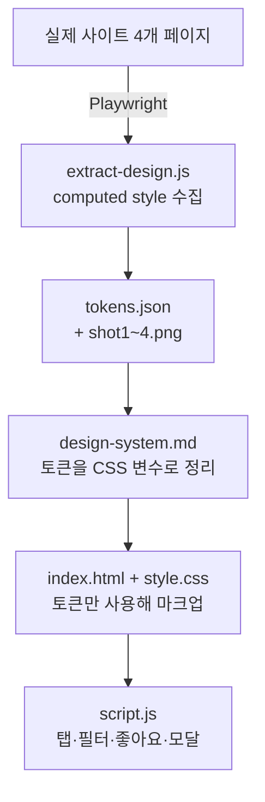
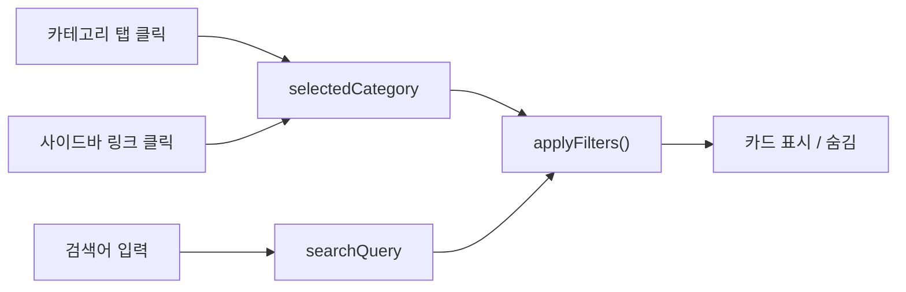

`clone-project` 실습 내용을 정리했습니다. 눈으로 보고 색을 찍어 맞추는 방식이 아니라, **실제 사이트의 렌더 결과를 기계로 계측해서 디자인 토큰을 만들고, 그 값만으로 클론을 만드는** 흐름입니다.

## 1. 전체 흐름



단계마다 산출물이 하나씩 나오고, **다음 단계는 앞 단계의 산출물만 입력으로 받습니다.** 계측하는 쪽이 디자인을 정하지 않고, 디자인을 정한 쪽이 코드를 짜지 않는 구조입니다.

## 2. 1단계 — 실제 화면 계측

### 2.1 왜 `getComputedStyle`인가

CSS 파일에 적힌 값과 화면에 실제로 그려진 값은 다를 수 있습니다. 상속, 캐스케이드, 미디어 쿼리, 브라우저 기본값이 모두 적용된 **최종 결과**를 알아야 하는데, 그것을 돌려주는 것이 `getComputedStyle`입니다.

```js
const style = window.getComputedStyle(el);
style.color;      // "rgb(26, 28, 32)"  <- 최종 계산값
style.fontSize;   // "14px"
```

### 2.2 보이는 요소만 세기

`document.querySelectorAll('*')`로 모든 요소를 훑되, 화면에 실제로 보이는 것만 집계합니다.

```js
const rect = el.getBoundingClientRect();
const style = window.getComputedStyle(el);

if (rect.width <= 0 || rect.height <= 0 ||
    style.display === 'none' || style.visibility === 'hidden') {
  continue;
}
```

| 조건 | 걸러내는 대상 |
|------|---------------|
| `rect.width/height <= 0` | 크기가 없는 요소 |
| `display: none` | 렌더 트리에서 빠진 요소 |
| `visibility: hidden` | 자리는 차지하지만 안 보이는 요소 |

세 조건이 모두 필요한 이유는 **"안 보인다"는 상태가 한 가지가 아니기** 때문입니다. `display: none`은 레이아웃에서 아예 빠지고, `visibility: hidden`은 자리를 차지한 채 투명해집니다.

### 2.3 값 정규화

같은 색이 `rgb(255, 102, 0)`, `#FF6600`, `#ff6600`으로 흩어지면 빈도를 셀 수 없습니다. 그래서 수집한 값을 한 형태로 통일합니다.

| 속성 | 정규화 규칙 |
|------|-------------|
| 색상 | `rgb()` → 대문자 HEX. **알파가 1보다 작으면 버린다** |
| `border-radius` | 여러 값 중 최댓값 하나만. `999px` 이상은 `알약` |
| `font-family` | 첫 번째 글꼴만, 따옴표 제거 |

```js
const match = rgbStr.match(/rgba?\((\d+),\s*(\d+),\s*(\d+)(?:,\s*([\d.]+))?\)/);
const [, r, g, b, alpha] = match;
if (alpha && parseFloat(alpha) < 1) return null;   // 반투명은 토큰이 아니다
```

반투명을 버리는 이유는 그 값이 **배경에 따라 달라 보이는 결과값**이라서, 다시 쓸 토큰이 될 수 없기 때문입니다.

### 2.4 시스템 토큰과 예외를 가르는 기준

이 스크립트의 핵심 아이디어입니다. 값이 **몇 개의 페이지에 나타나는지**로 판정합니다.

```js
data.classification = uniquePages.length >= 2
  ? '시스템'
  : '한 페이지에만 — 예외일 수 있음';
```

한 페이지에만 있는 값은 그 화면의 특수 사정일 가능성이 큽니다. 두 페이지 이상에서 반복되면 의도된 규칙으로 볼 근거가 생깁니다.

실제 결과는 이렇습니다.

| 항목 | 수 |
|------|-----|
| 분석한 페이지 | 4개 |
| 수집한 토큰 | 146개 |
| 시스템 토큰 (2페이지 이상) | 74개 |
| 한 페이지에만 등장 | 72개 |

절반이 걸러졌습니다. 이 74개가 클론에서 쓸 값의 후보가 됩니다.

## 3. 2단계 — 역할을 도구 권한으로 나누기

`.claude/agents/`에 에이전트를 세 개 두고, 각자 **쓸 수 있는 도구를 다르게** 줬습니다.

| 에이전트 | 역할 | 허용 도구 |
|----------|------|-----------|
| `reader` | 파일 읽고 요약 | `Read` |
| `ui-designer` | `tokens.json` + 스크린샷을 보고 디자인 시스템 정리 | `Read` |
| `web-publisher` | `design-system.md`의 값만으로 HTML·CSS 작성 | `Read`, `Write`, `Edit` |

핵심은 **지시가 아니라 권한으로 역할을 강제한다**는 점입니다. `ui-designer`에게 "코드를 짜지 마라"고 적어두는 것보다 `Write` 권한을 주지 않는 쪽이 확실합니다. `web-publisher`도 디자인 시스템 문서를 입력으로만 받으므로 값을 임의로 바꿀 여지가 줄어듭니다.

## 4. 3단계 — 토큰을 CSS 변수로

계측값을 `design-system.md`에 정리하고, 그대로 CSS 변수로 선언했습니다.

```css
:root {
  /* 텍스트 */
  --color-text-primary: #1A1C20;   /* 3,758회 - 가장 많이 쓰임 */
  --color-text-secondary: #555D6D;
  --color-text-tertiary: #868B94;

  /* 배경 */
  --color-bg-light: #F3F4F5;       /* 730회 */

  /* 강조 */
  --color-accent: #FF6600;
  --color-accent-hover: #FF6F0F;

  /* 간격 */
  --space-xs: 2px;
  --space-sm: 4px;
  --space-md: 6px;
  --space-base: 8px;
  --space-lg: 12px;
  --space-xl: 16px;

  /* 모서리 */
  --radius-sm: 4px;
  --radius-md: 6px;
  --radius-lg: 8px;
  --radius-xl: 12px;
  --radius-full: 9999px;
}
```

빈도수를 주석으로 남겨두면 **어떤 값이 기본값인지**가 코드에 드러납니다. 3,758회 쓰인 색이 본문 텍스트 색이라는 것은 추측이 아니라 계측 결과입니다.

간격 스케일이 `2, 4, 6, 8, 12, 16`인 것도 정해서 만든 게 아니라 **실제로 그 값들이 반복되어 나왔기** 때문입니다.

## 5. 4단계 — 바닐라 JS로 동작 붙이기

`script.js`는 라이브러리 없이 DOM API만 씁니다. 기능은 네 가지입니다.

### 5.1 탭 전환 — `classList` 토글

```js
tabs.forEach(tab => {
  tab.addEventListener("click", function() {
    const targetPage = this.getAttribute("data-page");

    tabs.forEach(t => t.classList.remove("active"));
    pages.forEach(p => p.classList.remove("active"));

    this.classList.add("active");
    document.getElementById(targetPage).classList.add("active");
  });
});
```

`style.display`를 직접 만지지 않고 **`active` 클래스만 붙이고 떼는** 방식입니다. 보이는 방법은 CSS가 결정합니다.

```css
.page { display: none; }
.page.active { display: block; }
```

전환할 대상은 `data-page` 속성에 적어두고 JS가 읽습니다. HTML이 "무엇과 연결되는지"를 갖고, JS는 그것을 옮기는 역할만 합니다.

### 5.2 필터 — 상태 변수와 단일 렌더 함수

카테고리 선택과 검색어라는 **두 조건이 동시에** 걸립니다. 이걸 각 이벤트에서 따로 처리하면 조합이 어긋나기 쉽습니다.

```js
let selectedCategory = "전체";
let searchQuery = "";

function applyFilters() {
  allCards.forEach(card => {
    const categoryMatch = selectedCategory === "전체"
      || card.getAttribute("data-category") === selectedCategory;
    const searchMatch = card.getAttribute("data-title")
      .toLowerCase().includes(searchQuery.toLowerCase());

    card.style.display = (categoryMatch && searchMatch) ? "" : "none";
  });
}
```

구조는 이렇습니다.



**입력은 세 군데지만 화면을 바꾸는 곳은 한 곳입니다.** 이벤트 핸들러는 상태 변수만 갱신하고 `applyFilters()`를 부릅니다. 두 조건은 `&&`로 묶여 교집합이 됩니다.

숨길 때 `display: "none"`, 보일 때 `display: ""`인 점도 의도적입니다. 빈 문자열은 인라인 스타일을 지우는 것이라서 원래 CSS가 정한 값으로 되돌아갑니다. `"block"`으로 되돌리면 원래 `flex`였던 요소가 깨집니다.

### 5.3 좋아요 버튼 — 이벤트 전파 막기

좋아요 버튼은 카드 안에 있습니다. 버튼을 누르면 클릭이 부모 카드까지 올라가서 카드 클릭까지 함께 실행됩니다.

```js
btn.addEventListener("click", function(e) {
  e.stopPropagation();   // 카드까지 올라가지 않게 막는다
  // ...
});
```

`stopPropagation()`이 없으면 **좋아요를 누를 때마다 카드 상세도 같이 열립니다.**

### 5.4 모달 — 바깥 클릭으로 닫기

```js
modal.addEventListener("click", function(e) {
  if (e.target === modal) {        // 오버레이 자신을 눌렀을 때만
    modal.classList.add("hidden");
  }
});
```

`e.target`이 `modal` 자신인지 확인하는 것이 핵심입니다. 이 검사가 없으면 모달 **내용을 클릭해도** 이벤트가 올라와서 창이 닫힙니다.

## 6. 정리 — 클라이언트 사이드의 방향

이 프로젝트에서 반복해서 나오는 패턴은 하나입니다.

> 상태를 한곳에 두고, 화면은 그 상태를 보고 그린다.

| 상태 | 화면에 반영되는 방법 |
|------|---------------------|
| 어느 탭이 선택됐나 | `active` 클래스 → CSS가 표시 결정 |
| 어느 카테고리·검색어인가 | 변수 2개 → `applyFilters()`가 일괄 반영 |
| 좋아요를 눌렀나 | 버튼 텍스트와 색 |
| 모달이 열렸나 | `hidden` 클래스 |

방향이 항상 **상태 → 화면** 한쪽입니다. 화면을 읽어서 상태를 판단하는 코드는 없습니다. 이 원칙을 라이브러리가 대신 강제해 주는 것이 React 같은 도구인데, 바닐라로 먼저 해보면 그 도구가 무엇을 대신해 주는지가 분명해집니다.

다만 지금 코드에는 그 원칙이 새는 곳이 하나 있습니다. 좋아요 상태를 **버튼의 텍스트로 판단**합니다.

```js
if (this.textContent === "♡") { /* ... */ }
```

화면을 읽어서 상태를 정하는 형태라, 상태를 따로 들고 있는 방식보다 깨지기 쉽습니다.

## 더 학습하면 좋은 개념

- **이벤트 위임(Event Delegation)** — 지금은 카드 18개에 리스너를 각각 붙인다. 부모 하나에만 붙이고 `e.target`으로 판별하면 리스너 하나로 끝나고, 나중에 추가된 카드에도 자동으로 동작한다. 카드를 JS로 그려 넣게 되는 순간 반드시 필요해진다.
- **`data-*` 속성과 `dataset`** — `getAttribute("data-category")` 대신 `el.dataset.category`로 읽을 수 있다. HTML에 상태를 실어 보내는 표준 방법이다.
- **인라인 스타일 대신 클래스로 숨기기** — `style.display`를 직접 쓰면 CSS와 우선순위 싸움이 된다. 클래스나 `hidden` 속성으로 숨기는 편이 관리하기 쉽다.
- **`DocumentFragment`와 리플로우** — 카드를 하나씩 DOM에 넣으면 그때마다 레이아웃이 다시 계산된다. 목록을 JS로 렌더하기 시작하면 성능 차이가 드러난다.
- **디자인 토큰과 테마 전환** — CSS 변수로 토큰을 잡아뒀으면 `:root`의 값만 갈아끼워 다크 모드를 만들 수 있다. 지금 구조가 이미 그 준비가 된 상태다.
- **Playwright의 다른 용도** — 여기서는 스타일 수집에만 썼지만, 같은 도구로 E2E 테스트와 시각적 회귀 테스트(스크린샷 비교)를 한다. 계측에 쓴 코드가 테스트 코드와 거의 같은 모양이다.

## 참고 자료

- [MDN - Window.getComputedStyle()](https://developer.mozilla.org/ko/docs/Web/API/Window/getComputedStyle)
- [MDN - Element.getBoundingClientRect()](https://developer.mozilla.org/ko/docs/Web/API/Element/getBoundingClientRect)
- [MDN - Element.classList](https://developer.mozilla.org/ko/docs/Web/API/Element/classList)
- [MDN - Event.stopPropagation()](https://developer.mozilla.org/ko/docs/Web/API/Event/stopPropagation)
- [MDN - EventTarget.addEventListener()](https://developer.mozilla.org/ko/docs/Web/API/EventTarget/addEventListener)
- [MDN - Document.querySelectorAll()](https://developer.mozilla.org/ko/docs/Web/API/Document/querySelectorAll)
- [MDN - CSS 사용자 지정 속성(변수) 사용하기](https://developer.mozilla.org/ko/docs/Web/CSS/Using_CSS_custom_properties)
- [MDN - input 이벤트](https://developer.mozilla.org/en-US/docs/Web/API/HTMLElement/input_event)
- [Playwright - Page](https://playwright.dev/docs/api/class-page)
- [Playwright - Screenshots](https://playwright.dev/docs/screenshots)
- [Claude Code - Subagents](https://docs.claude.com/en/docs/claude-code/sub-agents)
