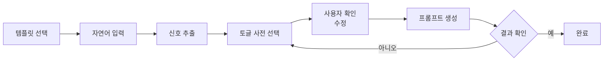
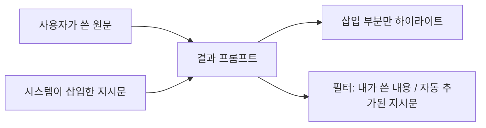

팀 프로젝트 `Yahoo_Prompt`의 기획 내용을 정리했습니다. **프롬프트 작성에 익숙하지 않은 사용자가 자연어로 쓰면, 규칙 기반으로 신호를 뽑아 AI가 잘 알아듣는 프롬프트로 정리해주는 도구**입니다.

기획 문서 자체보다, 그 문서를 쓰기 위해 만든 **양식**과 거기 담긴 설계 결정을 중심으로 정리했습니다.

## 1. 문제 정의

AI 사용자층은 계속 넓어지는데, 비전공자가 쓴 프롬프트는 의도한 결과를 뽑아내지 못하는 경우가 많습니다. 특히 40대 이상에서는 프롬프트 입력 자체를 어려워하는 경우가 흔합니다.

지금 이 문제의 해법은 사실상 두 가지뿐입니다.

| 기존 해법 | 부담 |
|-----------|------|
| 원하는 답이 나올 때까지 AI와 계속 씨름한다 | 시간과 시행착오 |
| 프롬프트 엔지니어링을 따로 공부한다 | 학습 비용 |

이 둘 사이의 빈 자리를 채우는 것이 목표입니다.

**타겟 사용자**는 ChatGPT·Gemini 같은 범용 AI를 업무·일상에 쓰려 하지만 프롬프트 작성에 익숙하지 않은 사람, 특히 40대 이상 비전공자입니다.

## 2. 핵심 설계 결정 세 가지

기획에서 가장 중요한 부분은 기능 목록이 아니라 **무엇을 하지 않기로 정했는가**였습니다.

### 2.1 규칙 기반 — LLM을 넣지 않는다

```
자연어 입력 → 키워드 매칭으로 신호 추출 → 지정 템플릿에 매핑
```

프롬프트를 만들어주는 도구인데 정작 LLM을 쓰지 않습니다. **구현 안정성을 최우선으로 두었기** 때문입니다. LLM을 넣으면 같은 입력에도 결과가 달라지고, 왜 그렇게 나왔는지 설명하기 어려워집니다. 규칙 기반은 결과가 항상 같고, 틀렸을 때 어느 키워드 때문인지 짚을 수 있습니다.

### 2.2 투명한 자동화 — 조용히 적용하지 않는다

추출한 신호를 바로 프롬프트에 반영하지 않습니다. 토글·선택 UI에 **"미리 선택된 상태"로만** 넣고, 사용자가 확인하고 고칠 수 있게 합니다.

확인 화면에서는 두 종류의 값을 시각적으로 구분합니다.

| 값의 출처 | 배지 표시 |
|-----------|-----------|
| 신호가 감지되어 자동 선택됨 | 브랜드 컬러 + 스파클 |
| 신호가 없어 기본값으로 채워짐 | 회색 테두리 |

이 구분이 중요한 이유는, 사용자가 **어디를 검토해야 하는지 알 수 있어야** 하기 때문입니다. 자동 감지된 값은 "맞나?" 확인할 지점이고, 기본값은 "내 상황과 다를 수도 있는" 지점입니다. 둘을 같은 모양으로 보여주면 전부 다시 읽어야 합니다.

### 2.3 공통 축 없음 — 전역 설정을 두지 않는다

모든 카테고리가 공유하는 전역 설정(모드, 길이 등)을 두지 않습니다. 각 카테고리는 **오직 전용 축만으로** 구성됩니다.

전역 설정을 두면 어느 카테고리에서는 의미가 없는 선택지가 화면에 남습니다. 카테고리별로 실제 의미 있는 축만 정의하는 쪽을 택했습니다.

## 3. 처리 흐름



되돌아가는 화살표가 **`토글 사전 선택`으로** 향하는 것이 핵심입니다. 결과가 마음에 안 들어 "아니오"를 선택해도 자연어를 다시 쓸 필요 없이, 그 화면에서 토글만 고쳐 재생성합니다. 재입력을 요구하면 사용자가 그 자리에서 이탈합니다.

## 4. 카테고리 구성

카테고리 5개를 4인이 분담합니다.

| 카테고리 | 설명 | 출력 형식 |
|----------|------|-----------|
| 작성 | 이메일·메신저·회의록·보고서·기획서 | 역할지정형 |
| 개인상담 | 고민·감정·인간관계 조언 | 역할지정형 |
| 의료질문/문진 | 증상 확인·진료 준비 | 역할지정형 |
| 여행계획 | 일정·코스 짜기 | 역할지정형 |
| **AI 사진생성** | 이미지 생성 프롬프트 만들기 | **태그나열형** |

**AI 사진생성만 출력 형식이 다릅니다.** 최종 결과물이 대화형 문장이 아니라 이미지 생성 AI용 태그 나열이기 때문입니다. 그래서 UI에서도 이 카테고리만 카드에 별도 배지를, 결과 화면에 별도 안내 문구를 씁니다.

같은 파이프라인을 쓰지만 산출물의 종류가 다르면 **UI에서도 그 차이를 드러내야** 사용자가 결과를 오해하지 않습니다.

## 5. 기획 양식 — 축을 어떻게 정의하는가

각 카테고리를 설계할 때 쓴 양식입니다. 칸이 다섯 개입니다.

```
[전용 축 N]
- 축 이름: ___________
- 좌: ___________ / 우: ___________   (3택 이상이면 선택지 나열)
- 좌 신호 키워드: ___________
- 우 신호 키워드: ___________
- 기본값(신호 없을 때): 좌 / 우 중 ___________

[카테고리 고정 규칙] (있다면)
- ___________
```

| 칸 | 역할 |
|----|------|
| 축 이름 | 무엇을 가르는 기준인가 |
| 선택지 | 그 기준의 값들 (2택 이상) |
| 신호 키워드 | 각 선택지를 고르게 만드는 표현들 |
| 기본값 | 아무 신호도 없을 때 무엇으로 둘지 |
| 고정 규칙 | 축과 무관하게 항상, 또는 특정 조건에서 삽입할 문구 |

**기본값 칸이 있는 것이 이 양식의 핵심입니다.** 규칙 기반 엔진은 키워드가 하나도 안 걸리는 입력을 반드시 만나게 됩니다. 그때 무엇으로 둘지 미리 정해두지 않으면 구현 단계에서 개발자가 임의로 결정하게 됩니다.

### 5.1 작성 예시 — 의료질문/문진

양식을 채우면 이렇게 됩니다.

**전용 축 1 — 목적**

| 항목 | 내용 |
|------|------|
| 좌 | 증상·질병 정보 알아보기 |
| 우 | 병원 가기 전 문진 준비하기 |
| 좌 신호 | 증상, 왜 그런지, 원인이 뭔지, 이게 무슨 병, 병명, ~인가요, 위험한가요, 심각한가요, 이 정도면 괜찮은지 |
| 우 신호 | 병원 가기 전, 의사한테 뭐라고, 진료 볼 때, 물어볼 거, 준비해야 할 거, 문진표, 예약했는데, 검사받으러 가는데 |
| 기본값 | 좌 (증상·질병 정보 알아보기) |

**전용 축 2 — 대상**

| 항목 | 내용 |
|------|------|
| 좌 / 우 | 본인 / 가족·보호 대상자 |
| 좌 신호 | 제가, 저는, 나는, 요즘 제가 (주어 없이 본인을 지칭하는 경우 포함) |
| 우 신호 | 엄마가, 아빠가, 아이가, 아들이, 딸이, 남편이, 아내가, 할머니가, 부모님이, 신생아, 영유아, 우리 애가 |
| 기본값 | 좌 (본인) |

**전용 축 3 — 증상 성격**

| 항목 | 내용 |
|------|------|
| 좌 / 우 | 갑자기 생긴 증상 / 오래된·만성 증상 |
| 좌 신호 | 갑자기, 어제부터, 오늘부터, 방금, 급격히, 순간적으로 |
| 우 신호 | 계속, 오래전부터, 몇 달째, 몇 년째, 만성, 반복적으로, 예전부터, 자꾸 재발 |
| 기본값 | 좌 (갑자기 생긴 증상) |

키워드를 보면 성격이 다릅니다. `대상` 축은 **주어**를 잡고, `증상 성격` 축은 **시간 부사**를 잡고, `목적` 축은 **문장의 의도**를 잡습니다. 같은 문장에서 서로 다른 층을 읽으므로 축끼리 간섭하지 않습니다.

### 5.2 고정 규칙과 겹침 처리

의료질문 카테고리의 고정 규칙은 두 개입니다.

```
- 생성 프롬프트 끝에 항상 안내문구 삽입:
  "이 정보는 진단을 대체하지 않으며, 응급 증상은 즉시 119/응급실로 문의하세요."
- 겹침 처리: 한 축에서 좌/우 신호가 동시에 감지되면,
  문장에서 더 나중에 등장한 신호를 우선 채택
```

**겹침 처리 규칙이 왜 필요한가.** "몇 달째 아팠는데 갑자기 심해졌어요"에는 `증상 성격` 축의 좌·우 신호가 같이 들어 있습니다. 규칙이 없으면 키워드 사전을 훑는 순서에 따라 결과가 달라집니다. "나중에 등장한 신호"를 택하는 것은 **사람이 말할 때 최신 상황을 뒤에 붙이는 경향**을 근거로 삼은 것입니다.

## 6. 카테고리 설정 스키마

양식을 데이터 구조로 옮기면 이렇게 됩니다.

```
카테고리 설정 = {
  이름,
  출력_형식: "역할지정형" | "태그나열형",
  전용_축: [
    { 축_이름, 선택지(2택 이상), 키워드사전(선택지별), 기본값 },
    ...
  ],
  고정_규칙: [
    { 조건: "항상" | "축_이름=값", 문구: "..." },
    ...
  ]
}
```

주목할 점은 `고정_규칙`의 `조건` 필드입니다. "항상 적용"과 "특정 축이 특정 값일 때만 적용"을 **하나의 배열 형식으로 통일**했습니다.

| 조건 | 예 |
|------|-----|
| `항상` | 의료질문의 응급 안내문구 |
| `축_이름=값` | 작성 카테고리의 `대상=상급자_외부인`일 때 존댓말 권장 |

두 경우를 따로 두면 필드가 늘어나고, 규칙을 읽는 코드도 두 갈래가 됩니다. 하나로 합쳐두면 순회 로직 하나로 끝납니다.

### 6.1 축 개수의 상한

축은 카테고리당 0개~N개로 자유롭게 구성합니다. 다만 **3~4개를 넘어가면 확인 화면의 토글이 많아져 UX 부담이 커집니다.** 이 경우 축을 줄이는 대신 디자인 단에서 아코디언(접기·펼치기)으로 밀도를 조절합니다.

선택지 체계가 아예 다른 특수 케이스는 기존 축에 억지로 넣지 않고 **별도 카테고리로 분리**합니다. (예: 학술 카테고리의 "논문분석" 모드)

## 7. 규칙 엔진의 경계 — 감지하지 않기로 한 것

목적지·이름처럼 **정해진 키워드 리스트로 판별할 수 없는 자유 슬롯**은 규칙 엔진으로 감지하지 않습니다.

지명은 사전을 만들 수가 없습니다. 전 세계 지명을 넣어도 신조어와 오타를 못 잡고, 사전이 커질수록 오탐도 늘어납니다. 대신 **입력창의 placeholder 문구로 유도**합니다.

> 여행계획 카테고리: "여행지와 함께 편하게 적어주세요"

규칙 기반을 택한 이상 **규칙으로 풀 수 없는 것을 규칙으로 풀려고 하지 않는 것**이 설계의 일부입니다. 못 하는 영역을 UI 문구로 넘기는 판단입니다.

## 8. 결과 확인 화면 UX



- 사용자가 쓴 원문은 그대로 두고, **시스템이 자동 삽입한 지시문만 하이라이트**합니다.
- "내가 쓴 내용 / 자동 추가된 지시문"을 필터로 나눠 볼 수 있습니다.
- 자동 감지된 값과 기본값으로 떨어진 값은 배지 스타일로 구분됩니다.

세 장치의 목적이 같습니다. **재검토 부담 줄이기.** 생성된 프롬프트 전체를 처음부터 읽게 만들면 도구를 쓴 의미가 없어집니다.

## 9. 진행 상황과 남은 과제

디자인은 Figma Make로 3~4라운드 피드백을 반영하는 중입니다. 라운드별 초점이 이렇게 옮겨갔습니다.

| 라운드 | 초점 |
|--------|------|
| 1 | 톤 통일(브랜드 컬러), 여백·레이아웃, 카드 크기, 스텝 인디케이터 |
| 2 | 카테고리 5개 3·2 그리드 배치, 아이콘·서브 라벨 정리 |
| 3 | "AI 프롬프트 도구" 정체성 강화 (터미널 기호, 비교 예시 카드, 자동감지 스파클) |
| 4 | 자동감지·기본값 배지 구분, 토글 3~4개 카테고리의 확인 화면 밀도 개선 |

**남은 과제**

- 개인상담 — 관계유형(축1)과 상담주제(축4)의 말투가 충돌할 때 우선순위 결정
- 5개 카테고리 스키마 최종본을 `/schemas` 폴더에 취합
- 개인상담 — "개입 방식" 축 삭제 여부, "상담 스타일" 4택→3택 확정 여부
- 배포 방식(Chrome 웹스토어 등록 등) — 우선순위 낮음

1차 목표는 웹페이지이고, 이후 Chrome 확장 프로그램(오버레이 형태)으로 확장할 계획입니다.

## 더 학습하면 좋은 개념

- **결정 테이블(Decision Table)** — 이 기획의 축·신호·기본값 구조가 사실상 결정 테이블이다. 조건 조합이 늘어날 때 빠짐과 겹침을 체계적으로 점검하는 방법이 정리되어 있어서, 축이 4개를 넘어갈 때 바로 필요해진다.
- **형태소 분석과 한국어 토크나이징** — 지금은 문자열 포함(`includes`) 매칭이다. "아팠는데"에서 "아프다"를 잡으려면 어간 추출이 필요하다. 규칙 기반의 정확도를 올리는 다음 단계다.
- **정규표현식** — "~인가요", "~때문인지" 같은 어미 패턴은 단순 포함 검사보다 정규식이 정확하다. 다만 사전이 커질수록 성능과 가독성 문제가 생긴다.
- **점진적 개시(Progressive Disclosure)** — 축이 많아질 때 아코디언으로 밀도를 낮추는 것이 이 원칙의 적용이다. 무엇을 먼저 보여주고 무엇을 접을지 정하는 기준이 정리되어 있다.
- **색만으로 정보를 전달하지 않기(WCAG)** — 자동감지·기본값 배지를 색으로 구분하는데, 색약 사용자에게는 구분되지 않는다. 스파클 아이콘을 함께 쓴 것이 이 원칙에 맞는 처리이고, 문구까지 붙이면 더 안전하다.
- **프롬프트 엔지니어링 패턴** — 역할지정형·태그나열형이라는 두 출력 형식을 정했는데, 각 형식이 왜 효과가 있는지는 모델 제공사 문서에 정리되어 있다. 템플릿의 근거가 된다.

## 참고 자료

- [OpenAI - Prompt engineering](https://platform.openai.com/docs/guides/prompt-engineering)
- [Anthropic - Prompt engineering overview](https://docs.claude.com/en/docs/build-with-claude/prompt-engineering/overview)
- [Google - Gemini API 프롬프트 전략](https://ai.google.dev/gemini-api/docs/prompting-strategies)
- [Chrome for Developers - 확장 프로그램 시작하기](https://developer.chrome.com/docs/extensions/get-started)
- [MDN - 정규 표현식 가이드](https://developer.mozilla.org/ko/docs/Web/JavaScript/Guide/Regular_expressions)
- [JSON Schema - Getting started step by step](https://json-schema.org/learn/getting-started-step-by-step)
- [W3C WCAG 2.2 - Use of Color](https://www.w3.org/WAI/WCAG22/Understanding/use-of-color)
- [GitHub Docs - 이슈·PR 템플릿](https://docs.github.com/en/communities/using-templates-to-encourage-useful-issues-and-pull-requests/about-issue-and-pull-request-templates)
