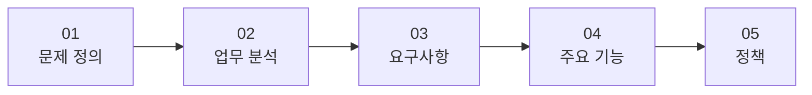
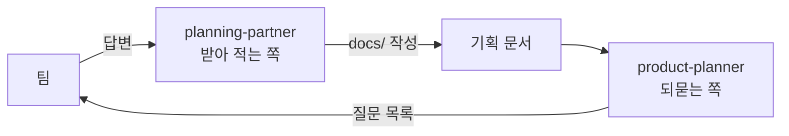

기획을 어떻게 문서로 남기는지 배우고, 그 절차를 에이전트 두 개로 만들어 실제 프로젝트에 적용했습니다. 결과물보다 **절차와 표기 규칙**이 핵심이라 그쪽을 중심으로 정리했습니다.

## 1. 기획 문서 5단계

기획을 한 문서에 몰아 쓰지 않고 다섯 단계로 쪼갭니다.



| 문서 | 채우는 것 | 부여하는 ID |
|------|-----------|-------------|
| `01-problem.md` | 문제·대상·현재해법·불편, 유사 서비스 | — |
| `02-workflow.md` | 행위자, 단계(As-Is → To-Be) | `A`, `S` |
| `03-requirements.md` | "~할 수 있어야 한다" 형태의 요구 | `R` |
| `04-features.md` | 트리거·입력·결과·예외 | `F` |
| `05-policy.md` | 누가·언제·할 수 없다·까지 | `P`, `SP` |

**앞 문서의 ID를 뒤 문서가 가리킵니다.** 요구(R)마다 어느 단계(S)에서 나왔는지, 기능(F)마다 어느 요구(R)를 만족시키는지 적습니다. 이 연결이 있으면 "왜 이 기능이 있는가"를 문서만 보고 거슬러 올라갈 수 있습니다.

## 2. 에이전트 두 개, 서로 못 하는 일이 다르다



| | planning-partner | product-planner |
|---|---|---|
| 역할 | 인터뷰하고 받아 적는다 | 빈칸을 찾아 질문으로 돌린다 |
| 허용 도구 | `Read`, `Write`, `Edit` | **`Read`만** |
| 쓰기 범위 | `docs/` 아래만 | 없음 |
| 금지 | 대신 정하기, 말을 매끄럽게 고치기 | 문서 대신 쓰기, 예시 답 제시 |

코치 역할에 `Read`만 주는 것이 핵심입니다. "문서를 대신 쓰지 마라"고 지시문에 적는 것보다, **쓰기 권한을 주지 않는 쪽이 확실합니다.**

받아 적는 쪽에도 제약이 걸려 있습니다.

- **팀이 말한 것은 그대로 적는다** — 말을 다듬지 않고 팀의 단어를 쓴다
- **질문은 한 번에 하나만** — 여러 개를 던지면 답이 뭉개진다
- **"이걸로 하자"고 쓰지 않는다** — 우선순위·채택·거절은 팀이 말한 대로만 적는다

"대신 정해 달라"는 요청에도 정하지 않고, 후보를 `[제안]`으로 내는 것까지만 합니다.

## 3. 세 가지 표기 규칙

이 절차에서 가장 실용적인 부분입니다. 문서의 각 칸이 **어떤 상태인지**를 기호로 구분합니다.

| 표기 | 의미 | 처리 |
|------|------|------|
| `[?]` | 팀이 아직 모른다 | 코치가 다시 묻지 않고 **개수만 센다** |
| `[제안]` | AI가 보탠 후보 | 반드시 **근거 한 줄**을 붙인다 |
| `(판정 필요)` | 팀이 앱 부품 이름으로 답했다 | 그대로 적고 줄 끝에 표시 |

### 3.1 `[?]` — 빈칸과 모르는 칸을 구분한다

그냥 비워두면 "아직 안 물어본 칸"과 "물어봤지만 팀도 모르는 칸"이 섞입니다. `[?]`로 표시해두면 코치는 **표시 없이 비어 있는 칸만** 질문으로 돌립니다. 같은 질문을 반복해서 받는 일이 없어집니다.

문서 머리에 개수를 적어둡니다.

```
> 문서: 02-workflow.md · 상태: 초안 · 열린 질문 [?] 14개
> 채택한 [제안] 0개 (제안 6개 검토 대기) · 마지막 갱신: 화요일
```

**모르는 것의 개수가 진행 지표가 됩니다.** 문서가 채워졌는지가 아니라, 모르는 게 몇 개 남았는지로 상태를 봅니다.

### 3.2 `[제안]` — AI가 보탠 것을 섞지 않는다

AI가 후보를 채워주면 편하지만, 팀이 말한 것과 섞이면 나중에 구분이 안 됩니다. 그래서 태그와 근거를 강제합니다.

```
| A2 | [제안] 구성원(부원) | 공지를 보고 참석 여부를 답하거나,
     못 보고 지나가 날짜·장소를 다시 묻는 사람
     — 근거: 01 문제 "매번 3~4명이 날짜·장소를 다시 묻는다" |
```

근거는 **앞 문서의 어느 줄에서 왔는지**를 적습니다. 근거를 못 쓰면 그 제안은 지어낸 것이라는 뜻이 됩니다. 태그를 붙이는 규칙이 사실상 **환각 방지 장치**로 작동합니다.

채택되면 태그를 지우고, 거절되면 문서 끝의 표로 옮깁니다.

```
## 검토했으나 제외
| 후보 | 출처(누구 초안 · [제안]) | 제외 이유 |
```

**거절한 것을 지우지 않고 이유와 함께 남깁니다.** 나중에 같은 아이디어가 다시 나왔을 때 왜 안 했는지 다시 논의하지 않아도 됩니다.

### 3.3 `(판정 필요)` — 부품 이름으로 답하면 표시한다

팀이 "버튼", "화면", "DB", "로그인" 같은 앱 부품 이름으로 답하면 그대로 적고 줄 끝에 `(판정 필요)`를 붙입니다.

기획 단계에서 부품 이름이 나오면 **아직 정해지지 않은 업무를 구현 방식으로 건너뛴 것**입니다. 지우지 않고 표시만 해두는 이유는, 그 답 자체가 팀이 무엇을 상상하고 있는지 알려주는 정보이기 때문입니다.

## 4. 코치가 잡아내는 세 가지 오류

`product-planner`가 문서를 읽고 지적하는 패턴입니다. 기획 문서에서 흔한 실수 목록이라 그대로 옮길 가치가 있습니다.

| 오류 | 왜 문제인가 | 올바른 형태 |
|------|-------------|-------------|
| 문제 정의에 해결책이 들어 있다 ("○○ 앱을 만든다") | 문제와 해법을 섞으면 다른 해법을 검토할 수 없다 | 문제 정의에는 기능이 없다 |
| 기능의 주어가 앱이다 ("앱이 알려 준다") | 누가 무엇을 할 수 있는지가 사라진다 | 기능의 주어는 **행위자** |
| 정책에 기술 단어가 있다 (DB·로그인 방식·API) | 구현 선택이 규칙으로 굳어버린다 | 정책은 **누가·언제·할 수 없다·까지** |

여기에 하나 더, **확인할 수 없는 표현**을 찾아냅니다.

> "편리하다 · 좋다 · 잘 · 귀찮다" 같은 문장을 찾으면 원문을 그대로 인용하고 왜 확인할 수 없는지 한 줄로 적는다

실제로 저희 문서에도 걸릴 문장이 있습니다. 02번 S1 단계의 감정 칸에 "귀찮음을 느끼기도 하고"라고 적혀 있는데, 감정 칸은 원래 그런 표현을 받는 자리라서 이 경우는 남겨둡니다. 판정 기준은 **그 칸이 확인 가능한 값을 요구하는지**입니다.

### 4.1 참조 검사

문서를 여럿 읽을 때는 ID 연결을 검사합니다.

- 기능(F)마다 가리키는 요구(R)가 있는가
- 정책(P)이 가리키는 F가 있는가
- **어디서도 가리키지 않는 ID(고아)가 있는가**

고아 ID는 두 가지 중 하나입니다. 뒤 문서를 아직 안 썼거나, 필요 없는 항목을 만들었거나.

## 5. 초안 여러 개를 종합할 때

팀원이 각자 초안을 쓰면 `docs/drafts/<문서>-<이름>.md`에 둡니다. 이때 문제가 하나 생깁니다.

**초안의 ID는 임시입니다.** 각자 자기 문서를 보고 번호를 매겼으니 같은 `R4`가 서로 다른 항목을 가리킵니다.

| 상황 | 처리 |
|------|------|
| 종합 문서의 ID | 초안 번호를 쓰지 않고 **새로 매긴다** |
| 출처 표기 | `민수 초안 R4`처럼 **이름 + 초안 번호** |
| 초안이 가리키는 앞 문서 ID | 최종 문서에서 같은 항목을 찾아 **그 ID로 다시 가리킨다** |
| 못 찾으면 | `[?]` |

번호를 새로 매기면서 "이름 + 초안 번호"를 남기는 것이 요령입니다. 최종 문서만 봐도 그 항목이 **누구 초안에서 왔는지** 추적됩니다.

## 6. 발산 질문 — 빠진 것을 찾는 정해진 질문들

인터뷰가 끝나면 문서마다 정해진 질문을 한 번 더 던집니다.

| 문서 | 발산 질문 |
|------|-----------|
| 02 업무 분석 | "이 행위자가 겪을 수 있는데 아직 말하지 않은 단계나 불편은?" · "이 일에 얽힌 다른 사람은?" |
| 03 요구사항 | "이 불편에서 나올 수 있는 다른 요구는?" · "비슷한 다른 서비스가 반드시 갖춘 요구는?" |
| 04 기능 | "이 기능이 **안 되는** 경우 5개는?" · "같은 요구를 다른 방식으로 만족시키는 기능은?" |
| 05 정책 | "두 사람이 동시에 하면?" · "한도·시각·권한 중 아직 정해지지 않은 것은?" |

04번의 "안 되는 경우 5개"가 특히 실용적입니다. 예외 처리를 나중에 발견하지 않고 **기능을 정의하는 자리에서 같이** 뽑아냅니다.

## 7. 실제로 채운 01 문제 정의

이 절차로 팀 프로젝트(`Yahoo_Prompt`, 프롬프트 작성 도우미)의 문제 정의를 채웠습니다.

### 7.1 아이디어 선택 기록

후보를 표로 남기고 기준마다 O/X를 매깁니다.

| 후보 | 실제 사용 장면 | 구현 안정성 | 비전공자 즉시 사용 | 결과 |
|------|---------------|-------------|-------------------|------|
| 규칙 기반 신호 추출 | O | O | O | **선택** |
| LLM 기반 자유 슬롯 완전 자동화 | O | **X** | O | 탈락 |
| 프롬프트 학습 콘텐츠 제공형 | **X** | O | **X** | 탈락 |

**선택한 것만 적지 않고 탈락한 것과 그 이유를 남깁니다.** LLM 방식은 표현력이 더 높지만 구현 안정성에서 밀렸고, 학습 콘텐츠형은 "사용자가 직접 학습해야 하는 부담"이 그대로 남아 탈락했습니다.

평가 기준도 그대로 쓰지 않았습니다. 양식에 딸려온 예시의 기준을 버리고 **이 프로젝트에서 실제로 쓴 의사결정 기준**으로 바꿔서 채웠습니다.

### 7.2 4요소

| 칸 | 요지 |
|----|------|
| 문제 | 전문 영역 사용자는 프롬프트 엔지니어링 지식·에이전트로 의도와 결과의 간극을 메우지만, 일반 사용자는 그런 보정 수단 없이 떠오르는 말을 그대로 입력한다 |
| 대상 | 범용 AI를 업무·일상에 쓰려는 비전공자, 특히 40대 이상 |
| 현재해법 | 답이 나올 때까지 씨름하기 / 프롬프트 엔지니어링을 따로 공부하기 |
| 불편 | 시행착오로 시간을 쓰거나 학습에 별도 리소스를 들여야 함 |

불편 칸에는 이렇게 적어뒀습니다.

> 구체적인 소요 시간·반복 횟수는 수치화된 근거 없음 — 확인 필요

**없는 근거를 있는 것처럼 쓰지 않고, 없다고 적는 것**이 이 양식의 태도입니다.

### 7.3 유사 서비스

경쟁 서비스 3개를 "우리 문제 중 무엇을 푸는가 / 못 푸는가"로 나눠 적었습니다. 그리고 확인한 사람 열에 전부 이렇게 적혀 있습니다.

> 웹 검색으로 확인 — 실사용 미확인

검색 스니펫으로 채운 초안이라 팀원이 직접 설치·접속해 재확인해야 한다는 것을 문서에 남겼습니다. **초안의 신뢰도를 문서 안에 적어두는 것**이 나중에 그 표를 근거로 쓸 때 사고를 막아줍니다.

## 8. 근거의 두 종류 — 논리형과 통계형

이번에 정리한 것 중 가장 쓸모 있는 구분입니다.

"일반 사용자가 원하는 결과를 못 뽑아낸다"를 증명하려면 몇 %가 겪는 문제인지 조사해야 할 것 같습니다. 그런데 그럴 필요가 없는 종류의 명제입니다.

| 근거 유형 | 성립 방식 | 이 프로젝트에서 |
|-----------|-----------|-----------------|
| **통계형** | 발생 빈도를 수치로 보인다 | 필요 없음 |
| **논리형** | 구조적 차이 자체가 항상 성립한다 | 전문 영역엔 보정 수단이 있고 일반 사용자엔 없다는 **비대칭** |

전문 영역에는 프롬프트 엔지니어링 지식·에이전트라는 보정 수단이 있고 일반 사용자에게는 없습니다. 이 비대칭은 조사 없이도 성립하므로 문제 정의로 유효합니다.

**다만 정도의 문제는 통계가 필요합니다.** "특히 고령층에서 두드러질 것"이라는 부분은 논리만으로 안 되니 참고 데이터를 붙였습니다. 문서에 인용한 KISDI(2025)·KDI 조사 수치입니다.

| 지표 | 30대 | 50대 | 60대 | 70대 |
|------|------|------|------|------|
| 생성형 AI 인지도 ('아는 편이다' 이상) | 75.8% | — | 22.6% | 7.2% |
| AI챗봇 이용률 | 26.5% | 8.5% | 3.4% | — |

그리고 이 수치의 한계도 같이 적어뒀습니다.

> "프롬프트 작성 난이도"를 직접 측정한 수치는 아니고 "인지도·이용률" 지표이지만, 고령층일수록 AI 활용에 더 큰 진입장벽을 겪고 있음을 보여주는 간접 근거로 볼 수 있다

**직접 근거와 간접 근거를 구분해서 적는 것**이 핵심입니다. 인용한 수치가 무엇을 재고 무엇을 재지 않는지 밝혀두면, 나중에 그 근거가 공격받을 지점을 미리 아는 셈이 됩니다.

## 9. 현재 상태

| 문서 | 상태 | 열린 질문 `[?]` | 대기 중 `[제안]` |
|------|------|----------------|-----------------|
| 01 문제 정의 | 초안 (확인 필요 항목 표시됨) | — | — |
| 02 업무 분석 | 초안 | 14개 | 6개 |
| 03 요구사항 | 초안 | 6개 | 0개 |
| 04 주요 기능 | 미작성 | — | — |
| 05 정책 | 미작성 | — | — |

02·03번은 양식을 익히는 단계라 예시 도메인(모임 일정 관리 — 총무가 단톡방에 공지하고 참석 여부를 모으는 상황)으로 채워져 있습니다. 01번만 실제 프로젝트로 채운 상태이고, 02번 이후를 `Yahoo_Prompt`로 다시 채우는 것이 다음 작업입니다.

03번 `R1`에 남은 `[?]`가 이 절차의 성격을 잘 보여줍니다. 팀 답변이 요구사항 형태가 아니라 책임 소재 규칙("메시지를 읽지 않은 손해의 책임은 본인이 진다")이어서, **05 정책 문서 몫으로 보인다고 적고 다시 물어보는 중**입니다. 형태가 안 맞는 답을 억지로 요구사항 칸에 넣지 않습니다.

## 더 학습하면 좋은 개념

- **의사결정 기록(ADR, Architecture Decision Record)** — 「검토했으나 제외」 표가 사실상 ADR이다. 결정과 그 이유, 검토했으나 버린 대안을 함께 남기는 형식이 정리되어 있어서, 문서가 늘어날 때 참고할 수 있다.
- **사용자 여정 지도(Journey Map)** — 02번의 `단계 · 행동 · 감정 · 불편` 표가 여정 지도의 최소 형태다. 감정 곡선과 접점(touchpoint)을 어떻게 그리는지 알면 불편을 더 촘촘히 뽑을 수 있다.
- **사용자 스토리와 인수 조건** — 03번의 "~할 수 있어야 한다"는 사용자 스토리와 같은 형태다. 04번 양식의 비워둔 `인수 조건` 열을 무엇으로 채우는지가 여기에 정리되어 있다.
- **요구사항 추적 매트릭스(Traceability Matrix)** — A → S → R → F → P의 ID 연결이 추적 매트릭스다. 고아 ID 검사를 자동화하는 방법과, 변경이 생겼을 때 영향 범위를 찾는 방법으로 이어진다.
- **개방형 질문 설계** — "한 번에 하나만 묻는다"는 규칙의 근거. 유도 질문과 이중 질문이 답을 어떻게 왜곡하는지 알면 인터뷰 질문을 직접 설계할 수 있다.
- **서브에이전트의 도구 권한 설계** — 역할을 지시문이 아니라 허용 도구로 강제하는 방식. 어떤 도구를 빼면 어떤 행동이 불가능해지는지 이해하면 에이전트를 더 안전하게 나눌 수 있다.

## 참고 자료

- [Claude Code - Subagents](https://docs.claude.com/en/docs/claude-code/sub-agents)
- [Nielsen Norman Group - Journey Mapping 101](https://www.nngroup.com/articles/journey-mapping-101/)
- [Nielsen Norman Group - Open-Ended vs. Closed Questions](https://www.nngroup.com/articles/open-ended-questions/)
- [Atlassian - User stories with examples and a template](https://www.atlassian.com/agile/project-management/user-stories)
- [Usability.gov - Personas](https://www.usability.gov/how-to-and-tools/methods/personas.html)
- [정보통신정책연구원(KISDI)](https://www.kisdi.re.kr/)
- [한국개발연구원(KDI)](https://www.kdi.re.kr/)
