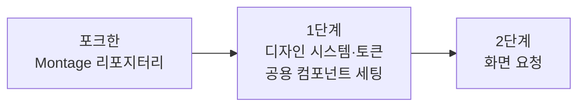
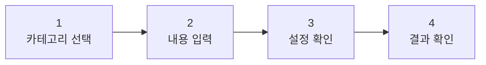

## 들어가며 (Situation)

팀 프로젝트 `QuickPrompt`(사용자가 일상어로 입력하면 AI용 프롬프트로 자동 변환해주는 서비스)의 UI를 만들어야 했습니다. 4단계 플로우에 카테고리 5개가 얽혀 있어서 화면 수가 적지 않았습니다.

Figma와 Claude Design 두 도구를 같은 날 써봤습니다. 이 글은 그 과정에서 시도한 **프롬프트 구성 방법**과, 두 도구를 써본 뒤의 판단을 정리한 것입니다.

## 문제 상황 (Task)

Claude Design으로 먼저 뽑아본 결과물이 기대에 못 미쳤습니다.

문제를 "AI가 디자인을 못한다"로 보지 않고 **입력이 부족한 것**으로 봤습니다. 화면을 바로 그리게 하면 색·간격·모서리 값이 화면마다 조금씩 달라집니다. 사람이 작업할 때도 디자인 시스템 없이 화면부터 그리면 같은 일이 생깁니다.

정리하면 제약은 이랬습니다.

| 제약 | 내용 |
|------|------|
| 화면 수 | 4단계 × 카테고리 5개 → 통일감이 무너지기 쉬움 |
| 팀 상황 | 전담 디자이너 없음, 처음부터 토큰을 정의할 시간 부족 |
| 요구 | 5개 카테고리 화면이 **하나의 시스템으로** 보여야 함 |

## 해결 과정 (Action)

### 1. 검토한 선택지

| 방안 | 장점 | 문제 |
|------|------|------|
| 디자인 시스템 없이 화면부터 요청 | 즉시 시작 | 화면마다 톤이 달라짐 (처음 시도한 방식) |
| 토큰을 직접 정의해서 넘기기 | 완전한 통제 | 색·타이포·간격 스케일을 처음부터 설계해야 함 |
| **공개된 디자인 시스템을 가져다 쓰기** | 검증된 값을 즉시 확보 | 우리 서비스 톤과 맞는지 확인 필요 |

세 번째를 골랐습니다. 원티드가 공개한 디자인 시스템 **Montage(몽타주)** 를 포크해서 제 GitHub 리포지터리에 두었습니다. 완전한 오픈소스를 목표로 공개된 것이라 가져다 쓸 수 있었습니다.

### 2. 프롬프트를 두 단계로 나눔

핵심은 **화면을 요청하기 전에 세팅 단계를 먼저 두는 것**이었습니다.

```
그룹웨어 시스템을 만들건데, 화면을 구성하기 전에
디자인 시스템과 디자인 토큰, 공용 컴포넌트들을 세팅하고자 해.
내 github repository 에서 가져올 예정이야
```

이 문장을 먼저 넣고, 그 다음에 화면 요청을 이어붙였습니다.



순서를 나눈 이유는 **뒤 요청이 앞 결과를 재료로 쓰게 만들기 위해서**입니다. 한 프롬프트에 "이런 톤으로 이런 화면들을 만들어줘"라고 몰아넣으면 톤은 화면마다 새로 해석됩니다. 토큰을 먼저 고정해두면 화면은 그 값을 가져다 쓰는 일이 됩니다.

### 3. 화면 요청 프롬프트의 구조

두 번째 프롬프트는 네 덩어리로 짰습니다.

| 블록 | 적은 내용 | 왜 넣었는가 |
|------|-----------|-------------|
| 서비스 소개 | 무엇을 하는 서비스인지 2~3줄 | 화면의 목적을 알아야 문구 톤이 맞음 |
| 전체 플로우 | 4단계 + 상단 스텝 인디케이터 | 화면 간 관계를 먼저 고정 |
| 화면별 상세 | 제목·부제·요소·버튼까지 | 문구를 AI가 지어내지 않게 함 |
| 톤앤매너 | 메인 컬러·배경·모서리·폰트 | 토큰과 충돌하지 않는 범위로 한정 |

전체 플로우는 이렇게 지정했습니다.



화면별 상세에서는 **제목과 부제를 직접 적어줬습니다.**

> 제목: "어떤 도움이 필요하신가요?"
> 부제: "분야를 고르면 그에 맞는 프롬프트로 자동 다듬어 드려요."

문구를 비워두면 AI가 그럴듯한 카피를 지어내는데, 서비스 성격과 어긋나는 경우가 많습니다. 문구는 기획에서 이미 정해진 값이라 넘겨주는 편이 맞습니다.

카테고리 5개는 아이콘 색까지 지정했습니다.

| 카테고리 | 색 | 아이콘 | 비고 |
|----------|-----|--------|------|
| 작성 | 보라 | 문서 | |
| 개인상담 | 핑크 | 하트 채팅 | |
| 의료질문 | 초록 | 청진기 | |
| 여행계획 | 노랑 | 나침반 | |
| AI 사진생성 | 파랑 | 반짝이 | "이미지 프롬프트" 배지 추가 |

AI 사진생성만 배지를 단 이유는 이 카테고리만 출력 형식이 다르기 때문입니다(태그 나열형). 산출물 종류가 다르면 화면에서도 구분되어야 사용자가 결과를 오해하지 않습니다.

### 4. 톤앤매너를 토큰과 겹치지 않게 적기

```
- 메인 컬러: 보라색(#7C3AED 계열)
- 배경: 밝은 아이보리/화이트 톤
- 둥근 모서리 카드, 그림자 최소화한 깔끔한 플랫 디자인
- 친근하고 따뜻한 느낌 (이모지 소량 사용)
- 폰트: 부드러운 산세리프
```

여기서 **정확한 픽셀 값을 적지 않은 것**이 의도한 부분입니다. 간격·모서리 반경·글자 크기는 1단계에서 가져온 디자인 시스템이 가진 값입니다. 톤앤매너에 다시 숫자를 적으면 두 출처가 충돌합니다.

## 결과 (Result)

### 두 도구 비교

| 항목 | Figma | Claude Design |
|------|-------|---------------|
| 결과물 완성도 | 더 나았음 | 기대에 못 미침 |
| 디자인 시스템 주입 | — | 프롬프트로 선행 세팅 시도 |
| 최종 선택 | **Figma** | |

**결론은 Figma 쪽이 더 나았다는 것**입니다. 디자인 시스템을 먼저 물려주는 방식으로 Claude Design의 결과를 개선하려 했지만, 같은 조건에서 Figma가 만든 화면이 더 쓸 만했습니다.

다만 이 비교에는 한계가 있습니다. **동일한 프롬프트로 여러 번 돌려 평균을 낸 것이 아니고, 평가 기준을 미리 정해두지도 않았습니다.** "보기에 더 낫다"는 주관적 판단이라 도구 성능의 일반적인 결론으로 삼기는 어렵습니다.

### 남은 것

프롬프트를 두 단계로 나눈 것 자체는 도구와 무관하게 재사용할 수 있는 방법입니다. 세팅 → 화면 순서는 Figma 쪽 작업에도 그대로 적용됩니다.

## 더 학습하면 좋은 개념

- **디자인 토큰 표준(W3C Design Tokens Format)** — 색·간격·타이포를 도구 간에 주고받는 표준 형식. Figma와 코드 사이에서 토큰을 동기화하려면 이 형식을 알아야 하고, AI 도구에 넘길 때도 표준 형식이 해석 오차를 줄여준다.
- **CSS 커스텀 속성** — 토큰을 실제 코드로 옮기는 수단. `:root`에 값을 모아두면 테마 전환까지 같은 구조로 처리된다.
- **아토믹 디자인** — 공용 컴포넌트를 어느 단위로 쪼갤지에 대한 분류법. "공용 컴포넌트를 먼저 세팅한다"고 할 때 무엇부터 만들지의 기준이 된다.
- **오픈소스 라이선스 확인** — 공개된 디자인 시스템을 포크해 쓸 때 무엇이 허용되는지는 라이선스가 정한다. 상업적 사용·수정·재배포 조건을 확인하는 습관이 필요하다.
- **A/B 비교 설계** — 이번 도구 비교의 약점이 여기 있다. 평가 기준을 미리 정하고 같은 조건에서 여러 번 돌려야 "어느 쪽이 낫다"고 말할 수 있다.

## 참고 자료

- [Wanted Montage - Getting started](https://montage.wanted.co.kr/docs/getting-started)
- [Figma Make](https://www.figma.com/make/)
- [W3C Design Tokens Format Module](https://tr.designtokens.org/format/)
- [W3C Design Tokens Community Group](https://www.w3.org/community/design-tokens/)
- [GitHub Docs - Fork a repo](https://docs.github.com/en/pull-requests/collaborating-with-pull-requests/working-with-forks/fork-a-repo)
- [Nielsen Norman Group - Design Systems 101](https://www.nngroup.com/articles/design-systems-101/)
- [MDN - CSS 사용자 지정 속성 사용하기](https://developer.mozilla.org/ko/docs/Web/CSS/Using_CSS_custom_properties)
