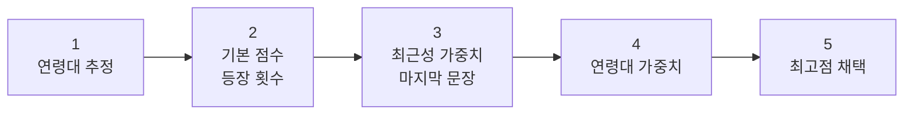
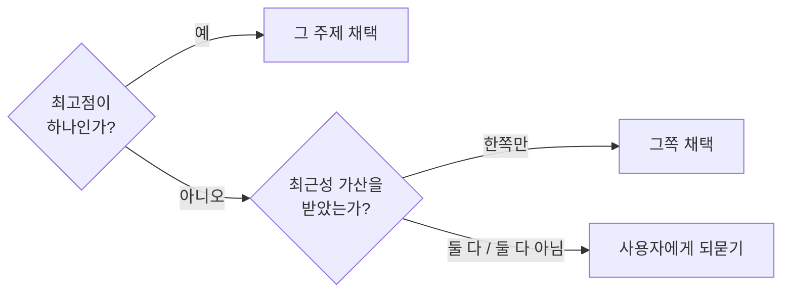

## 들어가며 (Situation)

팀 프로젝트 `Yahoo_Prompt`(자연어를 AI용 프롬프트로 바꿔주는 규칙 기반 도구)의 담당자 회의가 있었습니다. 5개 카테고리를 각자 하나씩 맡고 있고, 저는 **개인상담** 카테고리를 맡았습니다.

회의 자료는 안건별이 아니라 **담당자별로** 구성했습니다. 각자 자기 섹션에서 자기 몫의 확인·결정 사항을 바로 찾을 수 있게 하기 위해서입니다. 이미 확정된 것은 따로 모아 "확인만 하면 됨"으로 표시했습니다.

| 이미 확정된 것 (일부) | 내용 |
|----------------------|------|
| 로그인 | MVP는 로그인 없이 세션 기반 |
| 자연어 글자 수 상한 | 500자 |
| 재조정 루프 상한 | 3회 이상 조정 시 소프트 넛지(강제 종료 아님) |
| 겹침 처리 규칙 | 공통 정책으로 승격, 5개 카테고리 전부 공통 참조 |
| 동시 탭·창 | 탭마다 완전히 독립된 세션 상태 |

**끝난 것을 다시 논의하지 않도록 분리해두는 것**이 회의 자료의 핵심이었습니다. 논의할 것은 열린 질문만 남습니다.

## 문제 상황 (Task)

제 카테고리에서 열려 있던 문제입니다.

개인상담은 축이 3개입니다.

| 축 | 선택지 수 | 내용 |
|----|-----------|------|
| 축1 | 6택 | 상담 주제별 페르소나 (연애·인간관계·학업·진로·가족·자존감) |
| 축2 | 3택 | 상담 스타일 |
| 축3 | 2택 | 개입 방식 |

문제는 **축1에서 주제 키워드가 두 개 이상 동시에 잡힐 때 무엇을 고를지 기준이 없다**는 것이었습니다.

> "고3인데 시험 스트레스로 남자친구랑도 자꾸 싸워"

이 한 문장에 `학업`(시험)과 `연애`(남자친구)가 같이 들어 있습니다. 페르소나는 하나만 고를 수 있는데 기준이 없으면 키워드 사전을 훑는 순서에 따라 결과가 달라집니다.

### 기존 규칙으로는 왜 안 되는가

팀 공통 정책에 이미 겹침 처리 규칙이 있었습니다.

> 한 축에서 좌/우 신호가 동시에 감지되면, 문장에서 더 나중에 등장한 신호를 우선 채택

그런데 이 규칙은 **2택(좌/우) 축을 전제**로 만들어진 것입니다. 축1은 6택이고, 게다가 위 예문처럼 **두 주제가 한 문장 안에** 들어 있으면 "나중에 등장한 것"으로도 갈리지 않습니다.

| 규칙 | 적용 대상 | 축1에서 부족한 이유 |
|------|-----------|-------------------|
| 공통 겹침 처리 | 2택 축의 좌/우 | 6택에서 3개 이상 잡히면 순서만으로 부족 |
| 최근 등장 우선 | 문장이 여러 개일 때 | 한 문장 안에 둘 다 있으면 갈리지 않음 |

## 해결 과정 (Action)

### 1. 방향 선택 — 배제가 아니라 점수 합산

주제를 하나씩 배제해나가는 방식과, 전부에 점수를 매겨 최고점을 뽑는 방식을 두고 후자를 골랐습니다.

| 방식 | 장점 | 문제 |
|------|------|------|
| 조건 분기로 배제 | 규칙이 명시적 | 6택이면 조합이 폭증, 새 주제 추가 시 전부 수정 |
| **점수 합산** | 요인을 독립적으로 더할 수 있음 | 가중치 값의 근거가 필요 |

점수 합산을 고른 결정적인 이유는 **요인을 나중에 추가할 수 있다는 점**입니다. 조건 분기는 새 요인이 생기면 기존 분기를 전부 다시 짜야 하지만, 합산은 항을 하나 더하면 됩니다.

### 2. 세 가지 요인 설계



```
최종 점수 = 기본 점수 + 최근성 가중치 + 연령대 가중치
```

| 단계 | 규칙 | 근거 |
|------|------|------|
| 기본 점수 | 주제 키워드 등장 1회당 **+1** | 많이 언급할수록 비중이 크다 |
| 최근성 | **마지막 문장**에 등장한 주제에 **+2** | 사람은 결론이나 핵심을 뒤에 붙이는 경향이 있다 |
| 연령대 | 아래 표의 값을 더함 | 같은 단어라도 연령대에 따라 실제 고민의 무게가 다르다 |

최근성에 `+2`를 준 것은 기본 점수 1회분(+1)보다 크게 두기 위해서입니다. **한 번 더 언급한 것보다, 마지막에 말한 것을 더 무겁게 봅니다.**

### 3. 연령대 가중치 — 이 글의 핵심

같은 "인간관계"라는 단어라도 10대가 말할 때와 40대가 말할 때 뒤에 있는 상황이 다릅니다. 그래서 연령대별로 가중치를 다르게 뒀습니다.

| 연령대 | 연애 | 인간관계 | 학업 | 진로 | 가족 | 자존감 |
|---|---|---|---|---|---|---|
| 10대 | +1 | +2 | **+3** | 0 | 0 | +1 |
| 20대 | **+3** | +1 | 0 | +2 | 0 | +1 |
| 30대 | +1 | 0 | 0 | **+3** | +1 | +1 |
| 40대 | 0 | +1 | 0 | +1 | **+3** | +1 |
| 50대 이상 | 0 | +1 | 0 | 0 | +2 | **+3** |

표를 세로로 읽으면 설계 의도가 보입니다.

| 주제 | 가중치 흐름 |
|------|-------------|
| 학업 | 10대에만 +3, 20대부터 0 — 생애 단계가 지나면 사라지는 주제 |
| 진로 | 20대 +2 → 30대 +3 → 40대 +1 — 취업·이직 시기에 정점 |
| 가족 | 30대 +1 → 40대 +3 → 50대 +2 — 부양·양육이 시작되는 시점부터 |
| 자존감 | 전 연령 +1, 50대 이상만 +3 | 
| 연애 | 20대 +3에서 정점 후 감소 |

**자존감만 전 연령대에서 0이 아닙니다.** 특정 생애 단계에 묶이지 않는 주제라고 봤기 때문입니다.

### 4. 연령대를 모르면 어떻게 하는가

연령대는 명시적 신호로만 판별합니다.

```
"고3", "대학생", "취준생", "저 OO살", "직장 N년차", "애 엄마·아빠"
```

**신호가 없으면 "연령 미상"으로 두고 4단계를 아예 건너뜁니다.** 추정해서 넣지 않습니다. 나이를 잘못 짚으면 가중치가 통째로 틀린 방향으로 작동하는데, 그럴 바에는 기본 점수와 최근성만으로 가는 편이 낫다고 봤습니다.

이 판단은 팀의 다른 규칙과도 일관됩니다. 목적지(지명)처럼 키워드로 판별할 수 없는 값은 규칙 엔진으로 감지하지 않기로 이미 정해두었습니다.

### 5. 동점 처리 — 마지막은 사용자에게

점수 합산 방식의 약점은 동점입니다. 2단계로 처리합니다.



**끝까지 갈리지 않으면 단정하지 않고 되묻습니다.**

> "지금 OO 얘기랑 XX 얘기가 같이 나왔는데, 어느 쪽에 더 집중해서 얘기해볼까?"

규칙 기반 엔진에서 되묻기는 실패가 아니라 **설계된 출구**입니다. 반반인 상황에서 하나를 억지로 고르면 잘못 골랐을 때 사용자가 이유를 알 수 없습니다.

## 결과 (Result)

### 예시 계산

> "고3인데 시험 스트레스로 남자친구랑도 자꾸 싸워"

| 단계 | 학업 | 연애 |
|------|------|------|
| 1. 연령대 추정 | "고3" → 10대 | 10대 |
| 2. 기본 점수 | "시험" 1회 → +1 | "남자친구" 1회 → +1 |
| 3. 최근성 | 한 문장이므로 둘 다 → +2 | +2 |
| 4. 연령대(10대) | **+3** | +1 |
| **최종** | **6** | **4** |

→ 학업이 채택되어 페르소나는 "친한 선생님 모드"가 됩니다.

**연령대 가중치가 없었다면 3 대 3 동점**이었습니다. 기본 점수와 최근성만으로는 갈리지 않던 사례가 갈렸습니다. 이 공식이 실제로 하는 일이 이 한 줄에 드러납니다.

### 정리된 것과 남은 것

| 항목 | 상태 |
|------|------|
| 축1 다중 주제 우선순위 | 5단계 공식으로 정리 (부록A) |
| 반영 위치 | `03-requirements.md` R-상담9, `05-policies.md` P-상담5 |
| 가중치 값의 근거 | **경험적 추정 — 데이터로 검증되지 않음** |
| 다른 카테고리 적용 여부 | 미정 (축이 여러 개인 카테고리 전체에서 재검토 필요) |

가중치 표의 숫자는 사용자 데이터를 분석해서 나온 값이 아니라 **생애 단계에 대한 상식적 추정**입니다. 실제 로그가 쌓이면 조정해야 하는 값이라는 것을 문서에 남겨뒀습니다.

회의에서 나온 공통 미결 항목도 남아 있습니다 — 04 문서의 "노력(코치)" 칸이 대부분 비어 있어 MVP/v2 확정을 못 하고 있고, 데이터 보관기간·이용 연령 제한·유료 여부도 미정입니다.

## 더 학습하면 좋은 개념

- **가중 점수 모델과 정규화** — 지금은 가중치를 정수로 손으로 넣었다. 요인이 늘어나면 스케일이 서로 달라져 한 요인이 결과를 독점하게 되는데, 정규화가 그 문제를 다룬다.
- **다기준 의사결정(MCDA)** — 여러 기준으로 하나를 고르는 문제의 일반형. 가중치를 정하는 체계적인 방법(AHP 등)이 있어서, "왜 +3인가"에 답할 근거를 만들 수 있다.
- **TF-IDF** — 단어 등장 횟수를 그대로 점수로 쓰면 흔한 단어가 유리해진다. 흔한 단어의 가중치를 낮추는 표준적인 방법이라, 기본 점수 설계의 다음 단계가 된다.
- **콜드 스타트 문제** — 연령 신호가 없을 때 가중치를 포기하는 지금 방식이 콜드 스타트 대응이다. 추천 시스템에서 같은 문제를 어떻게 다루는지 보면 더 나은 기본값 전략이 보인다.
- **A/B 테스트로 가중치 검증** — 표의 숫자를 데이터로 바꾸는 방법. 어떤 지표를 성공으로 볼지(되묻기 비율 감소 등)부터 정해야 한다.
- **결정 테이블** — 축이 여러 개일 때 조합의 빠짐과 겹침을 점검하는 도구. 개인상담은 축2×축3 충돌 매트릭스를 이미 갖고 있는데, 그 방식을 다른 카테고리로 넓힐지 판단할 때 필요하다.

## 참고 자료

- [Anthropic - Prompt engineering overview](https://docs.claude.com/en/docs/build-with-claude/prompt-engineering/overview)
- [MDN - 정규 표현식 가이드](https://developer.mozilla.org/ko/docs/Web/JavaScript/Guide/Regular_expressions)
- [Nielsen Norman Group - Open-Ended vs. Closed Questions](https://www.nngroup.com/articles/open-ended-questions/)
- [Atlassian - User stories with examples and a template](https://www.atlassian.com/agile/project-management/user-stories)
