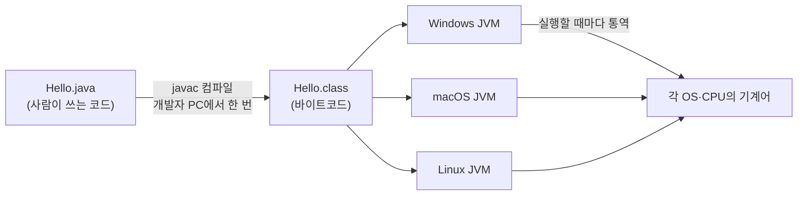
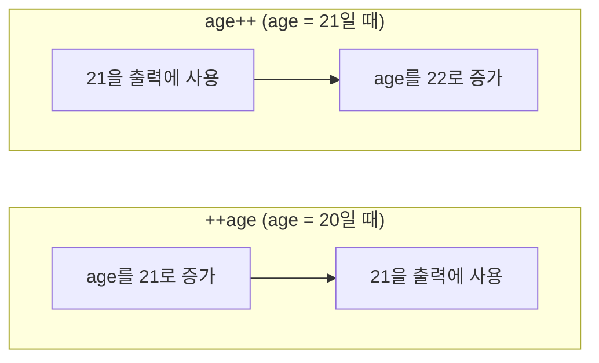

안녕하세요! 오늘 처음으로 자바를 배웠습니다.
JDK 설치부터 시작해서 변수, 형변환, 연산자까지 진도를 나갔는데, 첫날 가장 인상 깊었던 말은 이거였습니다.

> 자바는 컴퓨터를 위한 언어가 아니라, **사람을 위한 언어**다.

처음엔 무슨 뜻인지 몰랐는데, 자바가 실행되는 과정을 보고 나니 이해가 됐습니다. 그리고 오늘 제일 헷갈렸던 `age++`와 `++age`의 차이도 이 글에서 확실히 정리해 보려고 합니다.

## 1. JDK · JRE · JVM — 무엇을 설치한 걸까?

JDK는 자바 프로그램을 **만들고 실행하는 데 필요한 것**을 한 상자에 담은 꾸러미입니다. 안쪽부터 세 겹으로 되어 있습니다.

| 구성 | 포함하는 것 | 역할 |
|---|---|---|
| JVM | 클래스 로더, 바이트코드 검증기, 실행 엔진, 메모리 관리 | 바이트코드를 실제로 실행 |
| JRE | JVM + 표준 라이브러리(`java.lang`, `java.util`, `java.io` …) | 자바 프로그램을 **실행**하는 환경 |
| JDK | JRE + 개발 도구(`javac`, `java`, `jshell`, `javap`, `jar` …) | 자바 프로그램을 **만들고** 실행하는 환경 |

그래서 JDK 하나만 설치하면 JRE와 JVM이 같이 따라옵니다.

### 왜 JDK 21인가?

| 이유 | 설명 |
|---|---|
| LTS(장기 지원) | 자바는 6개월마다 새 버전이 나오지만, LTS 버전은 몇 년간 보안·버그 수정을 받는다 |
| Spring Boot 호환 | 최신 Spring Boot는 Java 17 이상을 요구하는데, 21은 이를 만족한다 |
| 검증된 안정성 | 더 최신 LTS인 25보다 자료·라이브러리·사례가 많이 쌓여 있다 |

### 설치와 확인 (Windows)

[Adoptium Temurin](https://adoptium.net/)에서 `Windows / x64 / JDK / 21 - LTS`를 받아 설치했습니다. 설치 옵션에서 **Add to PATH**와 **Set or override JAVA_HOME variable**을 모두 켜야 합니다.

| 환경 변수 | 의미 | 누가 쓰나 |
|---|---|---|
| `PATH` | 명령어를 찾을 폴더 **목록** | 터미널 — 어느 폴더에서든 `java`, `javac` 입력 가능 |
| `JAVA_HOME` | JDK 설치 폴더 주소 **하나** | IntelliJ, Gradle, Spring 같은 도구 |

설치 후에는 PowerShell을 **새로 열어야** 합니다. 설치 전에 열어둔 창은 예전 환경 변수를 기억하고 있기 때문입니다.

```powershell
java -version
javac -version
echo $env:JAVA_HOME
```

세 명령 모두 21이 보이면 설치 성공입니다.

## 2. 자바는 두 번 번역된다 — "사람을 위한 언어"의 의미

컴퓨터(CPU)가 실제로 이해하는 건 기계어뿐입니다. 우리가 쓰는 `.java` 코드는 **사람이 읽고 쓰기 위한 글**이고, 컴퓨터가 알아듣도록 바꾸는 일은 도구들이 대신 해줍니다.



| 시점 | 무엇이 | 무엇을 | 언제 |
|---|---|---|---|
| 컴파일 타임 | `javac` | `.java` → `.class`(바이트코드) | 개발자가 한 번 |
| 런타임 | JVM | 바이트코드 → 기계어 | 실행할 때마다 |

바이트코드는 특정 CPU가 아니라 **JVM을 위한 명령어**입니다. 그래서 같은 `Hello.class`를 Windows, macOS, Linux 어디로 옮겨도 그 OS의 JVM이 알아서 번역해 줍니다. 이것이 **WORA(Write Once, Run Anywhere)** 입니다. C처럼 운영체제마다 따로 컴파일할 필요가 없습니다.

### 첫 프로그램

```java
public class Main {
    public static void main(String[] args) {
        System.out.println("Hello World!!!!~");
    }
}
```

- 자바 코드는 모두 **클래스 안에서** 동작하고, `main()` 메서드가 프로그램의 시작점입니다.
- `public class` 이름과 파일 이름이 정확히 같아야 합니다. (대소문자 구분)
- 문장 끝에는 세미콜론 `;`을 붙입니다.
- 터미널에서 실행할 때는 `javac Hello.java`로 컴파일하고, `java Hello`로 실행합니다. (`.class`는 붙이지 않음)

## 3. 리터럴과 자료형

**리터럴**은 코드에 직접 적은 "값" 그 자체입니다. (`10`, `3.14`, `'ㅎ'`, `"안녕하세요!"`, `true`)
그 값을 담는 그릇의 종류가 **자료형**입니다.

| 분류 | 자료형 | 크기 | 예시 |
|---|---|---|---|
| 정수 | `byte` | 1 byte | `byte b = 10;` |
| 정수 | `short` | 2 byte | `short s = 10;` |
| 정수 | `int` | 4 byte | `int i = 10;` |
| 정수 | `long` | 8 byte | `long l = 10;` |
| 실수 | `float` | 4 byte | `float f = 3.14f;` (`f`를 꼭 붙인다) |
| 실수 | `double` | 8 byte | `double d = 3.14;` |
| 문자 | `char` | 2 byte | `char ch = 'ㅎ';` (작은따옴표) |
| 논리 | `boolean` | — | `boolean bl = true;` |
| 문자열 | `String` | — | `String str = "안녕하세요!";` (큰따옴표, 기본형이 아닌 클래스) |

변수는 선언과 초기화를 나눠서 할 수도 있고, 한 번에 할 수도 있습니다. 같은 `{}` 영역 안에서는 같은 변수 이름을 두 번 쓸 수 없습니다.

```java
int num;      // 선언
num = 10;     // 초기화

int num2 = 10; // 선언 + 초기화
```

### 키보드로 입력 받기 — Scanner

```java
Scanner sc = new Scanner(System.in);
System.out.print("당신의 이름을 입력하세요 : ");
String name = sc.nextLine();

System.out.println("이름 : " + name + "입니다!");
```

`java.util.Scanner`를 `import`하고, `nextLine()`으로 한 줄을 문자열로 읽어옵니다.

## 4. 형변환 — 그릇을 바꿔 담기

형변환은 값의 자료형을 다른 자료형으로 바꾸는 것입니다.

| 구분 | 방향 | 문법 | 데이터 손실 |
|---|---|---|---|
| 암시적(묵시적) | 작은 그릇 → 큰 그릇 (`int` → `double`) | 자동 | 없음 |
| 명시적 | 큰 그릇 → 작은 그릇 (`double` → `int`) | 값 앞에 `(자료형)` | **있을 수 있음** |

```java
double dnum = 99.99;
int inum = (int) dnum;   // 명시적 형변환
System.out.println("dnum = " + dnum);  // dnum = 99.99
System.out.println("inum = " + inum);  // inum = 99

int num2 = 100;
double dnum2 = num2;     // 암시적 형변환 → 100.0
```

`99.99`가 `100`으로 반올림되는 게 아니라 `99`가 됩니다. 소수점 아래를 **버리기** 때문입니다.
`(int)`를 빼고 `int inum = dnum;`이라고 쓰면 컴파일 에러가 납니다. 컴파일러가 "데이터가 손실될 수 있다"고 막는 것이고, `(int)`를 붙이는 건 "손실을 알고 감수하겠다"는 표시입니다.

## 5. 연산자

```java
int a = 10;
int b = 3;
```

| 종류 | 연산자 | 예시 | 결과 |
|---|---|---|---|
| 산술 | `+ - * / %` | `a / b`, `a % b` | `3`, `1` |
| 비교 | `== != < > <= >=` | `a > b`, `a != b` | `true`, `true` |
| 논리 | `&&`(AND) `\|\|`(OR) `!`(NOT) | `isFalse && isTrue` | `false` |
| 증감 | `++ --` | `++age`, `age++` | 아래에서 자세히 |

- `int / int`는 결과도 정수라서 `10 / 3`은 `3.333…`이 아니라 `3`입니다.
- `%`는 **나머지**를 구합니다. `10 % 3`은 `1`입니다.
- 문자열과 `+`를 만나면 숫자도 문자열로 바뀝니다. 그래서 계산식은 괄호로 먼저 묶어야 합니다.

```java
System.out.println("덧셈 : " + (a + b));  // 덧셈 : 13
System.out.println("덧셈 : " + a + b);    // 덧셈 : 103  ← "덧셈 : 10" + 3
```

## 6. 오늘 가장 헷갈렸던 것 — age++ vs ++age

수업 코드를 실행했을 때 결과가 예상과 달라서 한참 들여다봤습니다.

```java
int age = 20;
System.out.println("초기 값 age : " + (age));  // 20
System.out.println("++age : " + (++age));      // 21
System.out.println("age : " + (age));          // 21
System.out.println("age++ : " + (age++));      // 21  ← 왜 22가 아니지?
System.out.println("age : " + (age));          // 22
```

`age++`를 출력했는데 값이 그대로 `21`이 나와서 "증가가 안 된 건가?" 싶었는데, 바로 다음 줄에서 `22`가 찍혔습니다. 증가는 분명히 됐는데, **언제 증가하느냐**가 달랐던 것입니다.

| 구분 | 모양 | 순서 | 그 자리에서 쓰이는 값 |
|---|---|---|---|
| 전위 연산 | `++age` | **먼저 1 증가** → 그 값을 사용 | 증가한 값 |
| 후위 연산 | `age++` | **현재 값을 먼저 사용** → 그 다음 1 증가 | 증가하기 전 값 |



제가 정리한 기억법은 이렇습니다.

- **`++`가 앞에 있으면 증가가 먼저**, 뒤에 있으면 증가가 나중.
- `age++;`처럼 **한 줄에 혼자** 쓰면 전위든 후위든 결과가 같습니다. 차이는 출력문이나 다른 식 **안에서** 쓸 때만 드러납니다.

## 7. 면접 질문 — A && B에서 무엇을 앞에 둘까?

수업 코드 주석에 이런 면접 질문이 있었습니다.

> `A && B` 식이 있을 때 A가 앞에 오는 것과 B가 앞에 오는 것에 대한 고찰!

저는 수업에서 "효율성을 위해 더 짧은 걸 먼저 둔다"고 들었는데, 찾아보니 핵심은 **단락 평가(Short-circuit evaluation)** 였습니다.

- `&&`는 왼쪽이 `false`면 결과가 무조건 `false`이므로, **오른쪽은 아예 실행하지 않습니다.**
- `||`는 왼쪽이 `true`면 결과가 무조건 `true`이므로, 역시 오른쪽을 실행하지 않습니다.

그래서 "짧은 것"을 더 정확히 말하면 이렇습니다.

| 연산자 | 앞에 두면 좋은 조건 | 이유 |
|---|---|---|
| `&&` | **검사 비용이 싼 조건**, **`false`가 될 가능성이 높은 조건** | 앞에서 `false`가 나오면 뒤의 비싼 검사를 건너뛴다 |
| `\|\|` | 검사 비용이 싼 조건, **`true`가 될 가능성이 높은 조건** | 앞에서 `true`가 나오면 뒤를 건너뛴다 |

수업 코드의 `isFalse && isTrue`도 왼쪽이 `false`라서 `isTrue`는 확인하지 않고 바로 `false`가 됩니다.

순서는 효율만이 아니라 **안전**에도 영향을 줍니다. 아래는 이해를 돕기 위해 만든 예시 코드입니다.

```java
// 예시 코드
String name = null;

if (name != null && name.length() > 3) { // 안전: 앞이 false라 뒤를 실행하지 않음
    ...
}

if (name.length() > 3 && name != null) { // 에러: null에서 length()를 호출 → NullPointerException
    ...
}
```

## 마무리

| 오늘 배운 것 | 한 줄 정리 |
|---|---|
| JDK 구조 | JDK ⊃ JRE ⊃ JVM, JDK 하나면 개발과 실행 모두 가능 |
| 실행 방식 | 사람이 쓴 `.java` → `javac` → 바이트코드 → JVM → 기계어 |
| 형변환 | 큰 그릇 → 작은 그릇은 `(자료형)`을 붙이고, 손실을 감수 |
| 증감 연산 | `++`가 앞이면 증가 먼저, 뒤면 사용 먼저 |
| 논리 연산 | `&&`, `\|\|`는 단락 평가 — 싸고 결과를 빨리 정하는 조건을 앞에 |

첫날이라 낯선 용어가 많았지만, "자바는 사람을 위한 언어"라는 말이 컴파일과 JVM 구조를 보고 나서야 와닿았습니다. 사람이 읽기 좋은 코드를 쓰면, 나머지 번역은 `javac`와 JVM이 맡아준다는 뜻이었습니다.
가장 헷갈렸던 `age++`와 `++age`는 이제 "언제 증가하느냐"의 차이라는 걸 확실히 알게 됐습니다.

## 더 학습하면 좋은 개념

- **실수의 부동소수점 오차** — `0.1 + 0.2`가 정확히 `0.3`이 아닌 이유. `float`, `double`은 근사값이라 돈 계산에는 `BigDecimal`을 쓴다는 점까지 알면 실수형을 안전하게 쓸 수 있다.
- **정수 오버플로우** — `int`의 최댓값(약 21억)에 1을 더하면 음수가 된다. 자료형 크기를 표로 외운 것이 실제로 왜 중요한지 보여준다.
- **연산자 우선순위** — `"덧셈 : " + a + b`처럼 결과가 의도와 달라지는 식을 이해하려면 우선순위와 결합 방향을 알아야 한다.
- **JIT 컴파일러** — JVM은 바이트코드를 매번 한 줄씩 통역만 하지 않고, 자주 실행되는 코드는 기계어로 미리 바꿔둔다. "자바는 느리다"는 오해를 푸는 열쇠다.
- **`jshell`과 `java Hello.java`** — 컴파일 없이 한 줄씩 실행해 보거나(`jshell`, 종료는 `/exit`), 소스 파일을 바로 실행하는 방법. 오늘 배운 연산자를 빠르게 실험해 볼 수 있다.

## 참고 자료

- [Oracle Java Tutorials - Primitive Data Types](https://docs.oracle.com/javase/tutorial/java/nutsandbolts/datatypes.html)
- [Oracle Java Tutorials - Assignment, Arithmetic, and Unary Operators](https://docs.oracle.com/javase/tutorial/java/nutsandbolts/op1.html)
- [Oracle Java Tutorials - Equality, Relational, and Conditional Operators](https://docs.oracle.com/javase/tutorial/java/nutsandbolts/op2.html)
- [Java Language Specification (SE 21) - Chapter 5. Conversions and Contexts](https://docs.oracle.com/javase/specs/jls/se21/html/jls-5.html)
- [Java SE 21 API - Scanner](https://docs.oracle.com/en/java/javase/21/docs/api/java.base/java/util/Scanner.html)
- [Eclipse Adoptium - Temurin 다운로드](https://adoptium.net/)
