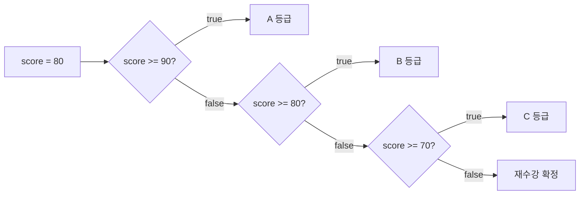
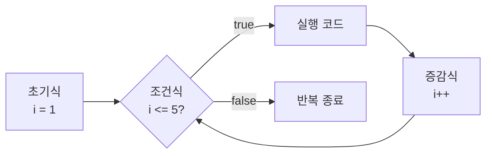
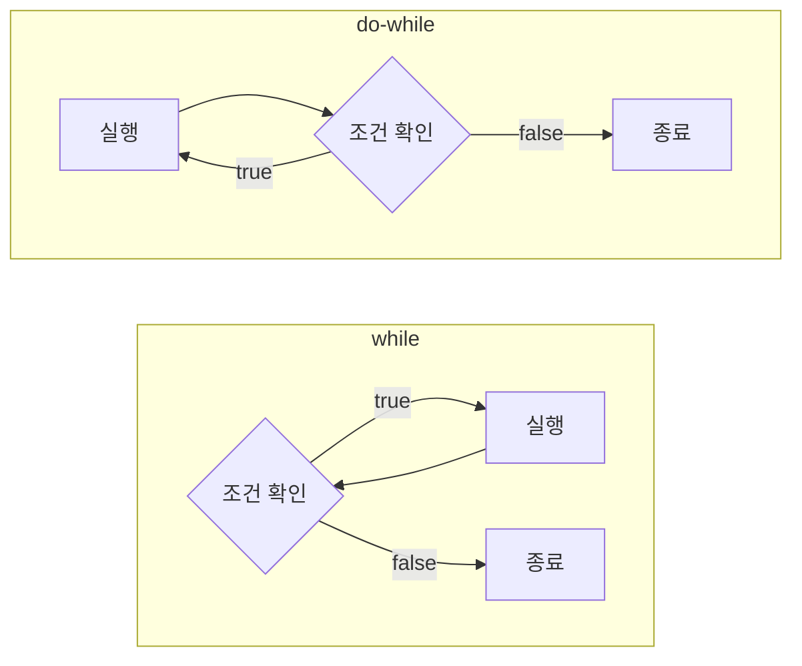
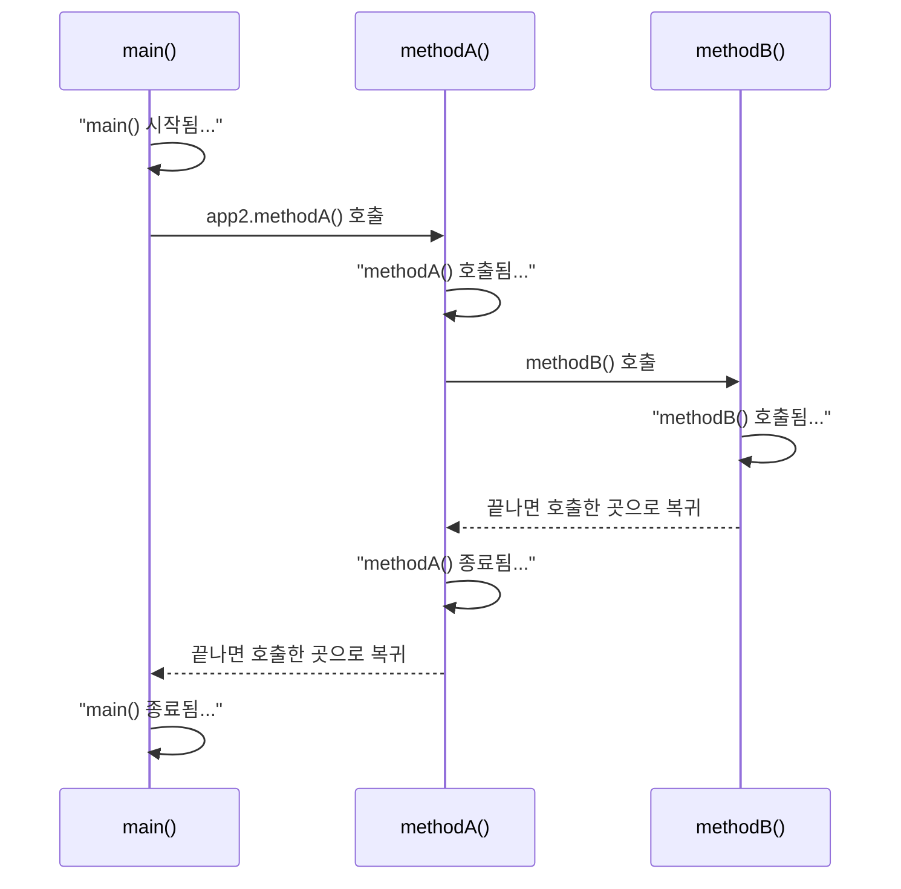

지금까지 작성한 코드는 위에서 아래로 한 줄씩 실행됐습니다.
이번 시간에는 그 흐름을 바꾸는 세 가지 도구를 배웠습니다.

| 도구 | 하는 일 | 문법 |
|---|---|---|
| 조건문 | 조건에 따라 실행할 코드를 **고른다** (분기) | `if`, `else if`, `else`, `switch` |
| 반복문 | 같은 코드를 **여러 번** 실행한다 | `for`, `while`, `do-while` |
| 메서드 | 코드를 이름 붙인 블록으로 묶고, 필요할 때 **불러 쓴다** | `반환타입 메서드명(매개변수) { }` |

## 1. if 조건문 — 조건에 따라 흐름 나누기

`if` 문은 조건식의 결과(`true` / `false`)에 따라 프로그램의 실행 흐름을 **분기**시키는 제어문입니다.

```java
if (조건식) {
    // 조건을 만족할 때 실행
} else {
    // 조건을 만족하지 않을 때 실행
}
```

조건이 여러 개면 `else if`를 이어 붙입니다. 점수에 따라 등급을 출력하는 수업 코드입니다.

```java
int score = 80;

if (score >= 90) {
    System.out.println("A 등급입니다!");
} else if (score >= 80) {
    System.out.println("B 등급입니다!");
} else if (score >= 70) {
    System.out.println("C 등급입니다");
} else {
    System.out.println("재수강 확정!");
}
```

```text
B 등급입니다!
```



조건은 **위에서부터 차례로** 검사하고, 처음 `true`가 나온 블록 하나만 실행합니다. 그래서 `score >= 80` 조건에 "90 미만"을 따로 쓰지 않아도 됩니다. 90 이상이었다면 첫 번째 블록에서 이미 끝났기 때문입니다.

### Scanner와 함께 쓰기 — 나이별 할인율

사용자가 입력한 나이에 따라 할인율을 정하는 프로그램입니다.

| 조건 | 할인율 |
|---|---|
| 13세 미만 | 50% |
| 65세 이상 | 30% |
| 그 외 | 0% |

```java
Scanner sc = new Scanner(System.in);
System.out.println("나이를 입력해주세요 : ");
int age = sc.nextInt();   // 입력값을 int로 읽는다

double discountRate;

if (age < 13) {
    discountRate = 0.5;
} else if (age >= 65) {
    discountRate = 0.3;
} else {
    discountRate = 0.0;
}

System.out.println("나이 : " + age + ", 할인율 : " + (discountRate * 100) + "%");
```

`70`을 입력하면 다음과 같이 출력됩니다.

```text
나이 : 70, 할인율 : 30.0%
```

`discountRate`는 선언만 하고 값을 넣지 않았지만, `if` / `else if` / `else`의 모든 경우에 값을 넣기 때문에 출력문에서 사용할 수 있습니다. 마지막 `else`가 없으면 값이 정해지지 않는 경우가 생기므로 컴파일 에러가 납니다.

## 2. 단축 평가 — 조건의 순서가 중요한 이유

논리 연산자 `&&`와 `||`는 **단축 평가(short-circuit evaluation)** 를 합니다. 왼쪽 결과만으로 전체 결과가 정해지면 오른쪽은 실행하지 않습니다.

| 연산자 | 결과 | 오른쪽을 건너뛰는 경우 | 왼쪽에 두면 좋은 조건 |
|---|---|---|---|
| `A && B` | 둘 다 `true`일 때만 `true` | A가 `false` | `false`가 될 확률이 높은 조건 |
| `A \|\| B` | 하나라도 `true`면 `true` | A가 `true` | `true`가 될 확률이 높은 조건 |

수업에서는 회원가입을 예로 들었습니다.

- A: 아이디 중복 여부 확인 (1분 걸리는 작업)
- B: 비밀번호 8글자 여부 확인 (0.5초 걸리는 작업)

```java
if (A && B) { 회원가입 성공! } else { 회원가입 실패! }
```

| 순서 | 사용자가 B 조건을 통과하지 못했을 때 실패를 알게 되는 시점 |
|---|---|
| `A && B` | A를 먼저 검사하므로 **1분** 뒤 |
| `B && A` | B가 `false`라서 A를 건너뛰므로 **0.5초** 뒤 |

결과는 같아도 조건의 순서에 따라 실행되는 작업이 달라집니다. 요청이 많은 서비스에서는 이 차이가 쌓이기 때문에, 확인하기 쉽고 결과를 빨리 정할 수 있는 조건을 왼쪽에 둡니다.

## 3. switch 문 — 값에 따라 여러 갈래로

`switch` 문은 하나의 값을 여러 경우와 비교해야 할 때 `if-else`를 길게 늘어놓는 대신 쓰는 문법입니다.

```java
switch (식) {
    case 값1:
        실행 코드;
        break;
    case 값2:
        실행 코드;
        break;
    default:
        기본 코드;
}
```

| 키워드 | 의미 |
|---|---|
| 식 | 비교할 값. 정수, 문자열 등 비교가 가능한 타입 |
| `case` | 식의 값과 일치할 때 실행할 코드 |
| `break` | `switch` 블록을 빠져나온다 |
| `default` | 일치하는 `case`가 없을 때 실행 (`if`의 `else` 역할) |

```java
int month = 2;

switch (month) {
    case 1:
        System.out.println("1월~");
        break;
    case 2:
        System.out.println("2월~");
        break;
    case 3:
        System.out.println("3월~");
        break;
    default:
        System.out.println("그 외의 월입니다.");
}
```

```text
2월~
```

| 비교 | `if-else` | `switch` |
|---|---|---|
| 조건 형태 | 범위, 복합 조건 (`score >= 90`, `a && b`) | 하나의 값과 **일치** 여부 |
| 잘 맞는 경우 | 점수 구간, 나이 구간 | 월, 메뉴 번호, 명령어 |

## 4. 반복문 — 같은 코드를 여러 번

반복문이 없으면 같은 출력문을 원하는 횟수만큼 복사해서 적어야 합니다.

```java
System.out.println("회원님 1번 했습니다~");
System.out.println("회원님 2번 했습니다~");
System.out.println("회원님 3번 했습니다~");
// ... 횟수가 늘어나면 줄도 계속 늘어난다
```

### for 문 — 횟수가 정해진 반복

```java
for (초기식; 조건식; 증감식) { 실행 코드 }
```

| 부분 | 역할 | 예시 |
|---|---|---|
| 초기식 | 반복을 제어할 변수의 시작값 | `int i = 1` |
| 조건식 | `true`면 반복, `false`면 종료 | `i <= 5` |
| 증감식 | 한 번 반복할 때마다 변수를 증가·감소 | `i++` |

벤치프레스 5회를 세는 프로그램에 "홀수 번째에만 말하고, 짝수 번째에는 침묵한다"는 조건을 추가한 수업 코드입니다. 짝수는 2로 나눈 나머지가 0이므로 `%` 연산자로 판단합니다.

```java
System.out.println("회원님 벤치프레스 5회 실시할게요");

for (int i = 1; i <= 5; i++) {
    if (i % 2 == 0) {
        System.out.println("침묵함...");
    } else {
        System.out.println("회원님 " + i + "번 했습니다~");
    }
}
```

```text
회원님 벤치프레스 5회 실시할게요
회원님 1번 했습니다~
침묵함...
회원님 3번 했습니다~
침묵함...
회원님 5번 했습니다~
```



초기식은 **처음 한 번만** 실행되고, 그 뒤로는 `조건식 → 실행 코드 → 증감식`이 반복됩니다.

### while 문 — 조건이 참인 동안 반복

```java
while (조건식) { 실행 코드; 증감식; }
```

반복 횟수가 정해져 있지 않거나, 특정 조건이 되면 멈춰야 할 때 사용합니다. 초기식은 `while` 바깥에, 증감식은 블록 안에 직접 적습니다.

```java
int count = 0;

while (count <= 5) {
    System.out.println("카운트 : " + count);
    count++;
}
```

```text
카운트 : 0
카운트 : 1
카운트 : 2
카운트 : 3
카운트 : 4
카운트 : 5
```

블록 안의 `count++`를 빠뜨리면 `count`가 계속 `0`이라 조건이 영원히 `true`가 되어, 반복이 끝나지 않습니다(무한 루프).

### do-while 문 — 일단 한 번은 실행

```java
do { 실행 코드 } while (조건식);
```

`do-while`은 실행 코드를 **먼저 한 번 실행한 뒤** 조건식을 확인합니다. 끝에 세미콜론 `;`이 붙는 점도 다릅니다.

```java
int num = 5;

do {
    System.out.println("0~3까지 반복 출력 : " + num);
    num++;
} while (num < 3);
```

```text
0~3까지 반복 출력 : 5
```

`num`이 `5`라서 조건 `num < 3`은 처음부터 `false`입니다. 그래도 조건을 확인하기 전에 블록이 먼저 실행되므로 한 번은 출력됩니다. 같은 코드를 `while`로 쓰면 아무것도 출력되지 않습니다.



### 세 반복문 비교

| 반복문 | 조건 확인 시점 | 최소 실행 횟수 | 주로 쓰는 경우 |
|---|---|---|---|
| `for` | 실행 전 | 0회 | 반복 횟수가 정해져 있을 때 |
| `while` | 실행 전 | 0회 | 반복 횟수가 불확실하고, 조건에 따라 멈출 때 |
| `do-while` | 실행 후 | **1회** | 최소 한 번은 반드시 실행해야 할 때 |

## 5. 메서드 — 반복되는 코드를 묶어서 재사용하기

### 메서드가 없을 때의 문제

두 수를 더해 출력하는 코드입니다.

```java
int num1 = 1;
int num2 = 2;
System.out.println("1번째 연산 결과: " + (num1 + num2));

int num3 = 3;
int num4 = 4;
System.out.println("2번째 연산 결과: " + (num3 + num4));
```

두 수를 더할 때마다 변수 선언 2줄과 연산·출력 1줄이 계속 반복됩니다.

### 메서드란?

**메서드**는 특정 작업을 수행하는 코드 블록입니다. 코드의 재사용성과 가독성을 높이고, 프로그램 구조를 체계적으로 만들어 유지보수를 쉽게 합니다.

```java
[접근제어자] [반환타입] 메서드명([매개변수타입 매개변수명]) {
    실행할 코드
    [return 반환값;]
}
```

```java
public int sumTwoNumber(int a, int b) {
    return a + b;
}
```

| 부분 | 코드 | 의미 |
|---|---|---|
| 접근제어자 | `public` | 어디서 이 메서드를 부를 수 있는지 |
| 반환타입 | `int` | 메서드가 돌려주는 값의 자료형. 돌려줄 값이 없으면 `void` |
| 메서드명 | `sumTwoNumber` | 호출할 때 사용하는 이름 |
| 매개변수 | `int a, int b` | 호출할 때 전달받는 값 |
| `return` | `return a + b;` | 결과값을 호출한 곳으로 돌려준다 |

메서드는 `main()` **바깥**, 클래스 안에 작성합니다.

### 메서드 호출하기

`main()`에서 같은 클래스의 메서드를 부르려면 먼저 클래스로 객체를 만들고, 참조 연산자 `.`로 메서드를 호출합니다.

```java
클래스명 변수명 = new 클래스명();
변수명.메서드명();
```

```java
Application01 app = new Application01();   // 클래스도 int처럼 자료형이 될 수 있다

System.out.println("3번째 연산 : " + app.sumTwoNumber(5, 6));
System.out.println("4번째 연산 : " + app.sumTwoNumber(7, 8));
System.out.println("5번째 연산 : " + app.sumTwoNumber(9, 10));
```

```text
3번째 연산 : 11
4번째 연산 : 15
5번째 연산 : 19
```

더하는 방법은 한 번만 작성하고, 값만 바꿔서 한 줄로 호출합니다. 메서드 이름 뒤의 소괄호 `()`는 메서드를 **호출한다**는 뜻입니다.

### 메서드 호출 흐름

메서드는 작성만 해서는 실행되지 않고, **호출해야** 실행됩니다. `main()`에서 `methodA()`를 부르고, `methodA()` 안에서 다시 `methodB()`를 부르는 수업 코드입니다.

```java
public class Application02 {
    public static void main(String[] args) {
        System.out.println("main() 시작됨...");

        Application02 app2 = new Application02();
        app2.methodA();

        System.out.println("main() 종료됨...");
    }

    public void methodA() {   // void: 반환값이 없다
        System.out.println("methodA() 호출됨...");
        methodB();
        System.out.println("methodA() 종료됨...");
    }

    public void methodB() {
        System.out.println("methodB() 호출됨...");
    }
}
```

```text
main() 시작됨...
methodA() 호출됨...
methodB() 호출됨...
methodA() 종료됨...
main() 종료됨...
```



| 정리 | 내용 |
|---|---|
| 시작점 | 프로그램은 항상 `main()`에서 시작한다 |
| 실행 조건 | 메서드는 호출해야 실행된다. `methodA()` 안에서 `methodB()`를 부르기 전에는 `methodB()`의 출력이 나오지 않는다 |
| 복귀 | 호출된 메서드가 끝나면, 호출한 바로 그 다음 줄로 돌아와 이어서 실행한다 |
| 같은 객체 안의 호출 | `methodA()` 안에서는 `methodB()`처럼 객체 이름 없이 바로 부를 수 있다 |

## 마무리

| 배운 것 | 한 줄 정리 |
|---|---|
| `if` / `else if` / `else` | 위에서부터 조건을 검사하고, 처음 `true`인 블록 하나만 실행 |
| 단축 평가 | `&&`는 `false` 확률이 높은 조건, `\|\|`는 `true` 확률이 높은 조건을 왼쪽에 |
| `switch` | 하나의 값을 여러 `case`와 비교, `break`로 탈출, `default`는 `else` 역할 |
| `for` | 초기식 → (조건식 → 실행 → 증감식) 반복, 횟수가 정해진 반복 |
| `while` / `do-while` | 조건이 참인 동안 반복, `do-while`은 최소 1회 실행 |
| 메서드 | 코드를 묶어 재사용, 호출해야 실행되고 끝나면 호출한 곳으로 복귀 |

## 더 학습하면 좋은 개념

- **switch의 fall-through와 새 switch 문법** — `case`에서 `break`를 빼면 다음 `case`까지 이어서 실행된다. Java 14부터는 `case 1 -> ...`처럼 화살표를 쓰는 switch 표현식이 추가되어 `break` 없이도 안전하게 쓸 수 있다.
- **break와 continue** — 반복문을 중간에 끝내거나(`break`), 이번 회차만 건너뛰는(`continue`) 키워드. `while`에서 조건에 따라 멈추는 코드를 작성할 때 필요하다.
- **변수의 스코프(Scope)** — `for (int i = 1; ...)`의 `i`는 반복문 밖에서 쓸 수 없다. 변수가 어느 `{}` 안에서 유효한지 알면 컴파일 에러를 이해하기 쉽다.
- **static 메서드** — `main()`에 붙은 `static`의 의미. `static` 메서드는 객체를 만들지 않고 호출할 수 있어서, `new Application01()` 없이 메서드를 부르는 방법과 연결된다.
- **호출 스택(Call Stack)** — `main → methodA → methodB` 순서로 쌓이고, 끝난 순서대로 빠져나오는 구조. 메서드 호출 흐름과 에러 메시지의 스택 트레이스를 읽는 기초가 된다.

## 참고 자료

- [Oracle Java Tutorials - The if-then and if-then-else Statements](https://docs.oracle.com/javase/tutorial/java/nutsandbolts/if.html)
- [Oracle Java Tutorials - The switch Statement](https://docs.oracle.com/javase/tutorial/java/nutsandbolts/switch.html)
- [Oracle Java Tutorials - The while and do-while Statements](https://docs.oracle.com/javase/tutorial/java/nutsandbolts/while.html)
- [Oracle Java Tutorials - The for Statement](https://docs.oracle.com/javase/tutorial/java/nutsandbolts/for.html)
- [Oracle Java Tutorials - Equality, Relational, and Conditional Operators](https://docs.oracle.com/javase/tutorial/java/nutsandbolts/op2.html)
- [Oracle Java Tutorials - Defining Methods](https://docs.oracle.com/javase/tutorial/java/javaOO/methods.html)
- [Java SE 21 API - Scanner](https://docs.oracle.com/en/java/javase/21/docs/api/java.base/java/util/Scanner.html)
