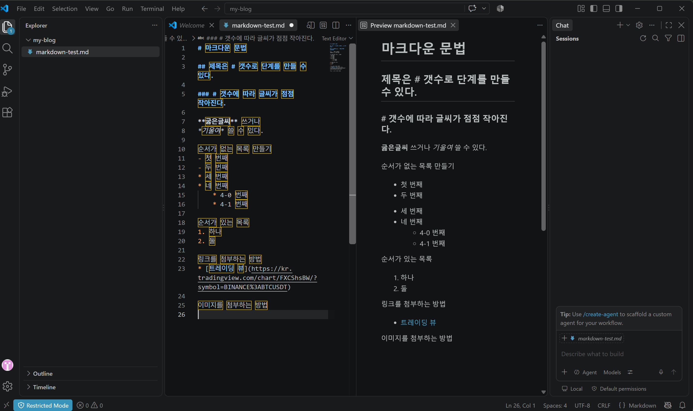

각 문법마다 **원본 코드**와 **실제로 보이는 모습**을 같이 적어뒀다.

## 제목 (Heading)

`#` 갯수로 제목 단계를 만들 수 있다. 갯수가 많아질수록 글씨가 작아진다.

```markdown
# 제목 1
## 제목 2
### 제목 3
```

위 코드는 이렇게 보인다 (실제 글에서는 `#`을 글 제목에 1번만 쓰고 본문은 `##`부터 시작한다):

> # 제목 1
> ## 제목 2
> ### 제목 3

## 굵게 / 기울임

```markdown
**굵은글씨** 쓰거나
*기울임* 쓸 수 있다.
```

**굵은글씨** 쓰거나
*기울임* 쓸 수 있다.

## 순서가 없는 목록

`-` 또는 `*` 둘 다 쓸 수 있고, 앞에 공백(들여쓰기)을 주면 하위 목록이 된다.

```markdown
- 첫 번째
- 두 번째
* 세 번째
* 네 번째
    * 4-0 번째
    * 4-1 번째
```

- 첫 번째
- 두 번째
* 세 번째
* 네 번째
    * 4-0 번째
    * 4-1 번째

## 순서가 있는 목록

```markdown
1. 하나
2. 둘
```

1. 하나
2. 둘

## 링크

```markdown
[트레이딩 뷰](https://kr.tradingview.com/chart/FXCShsBW/?symbol=BINANCE%3ABTCUSDT)
```

[트레이딩 뷰](https://kr.tradingview.com/chart/FXCShsBW/?symbol=BINANCE%3ABTCUSDT)

## 이미지

`!`가 링크 문법 앞에 붙으면 이미지가 된다. `[]` 안은 대체 텍스트, `()` 안은 이미지 경로.

```markdown

```

## 인용

`>`로 시작하면 인용 블록이 된다. 남의 말이나 정의를 옮길 때 사용한다.

```markdown
> 인용하는 구문은 꺽쇠로 만든다.
```

> 인용하는 구문은 꺽쇠로 만든다.

## 인라인 코드 / 코드 블록

`` ` ``(백틱, 1 옆에 있는 키)로 감싸면 인라인 코드가 되고, 백틱 3개(` ``` `)로 감싸면 코드 블록이 된다.

````markdown
`git status`

```
git status
git init
```
````

`git status`

```
git status
git init
```

## 표(Table)

`|`(파이프, 엔터키 위에 있는 키. 프로그래밍에서는 OR 연산자로도 쓰인다)로 칸을 나누고, 두 번째 줄의 `---`로 헤더와 본문을 구분한다.

```markdown
|명령어|하는 일|
|---|---|
|git add|스테이징 영역에 파일 추가|
|git commit|로컬 저장소에 저장|
```

|명령어|하는 일|
|---|---|
|git add|스테이징 영역에 파일 추가|
|git commit|로컬 저장소에 저장|
